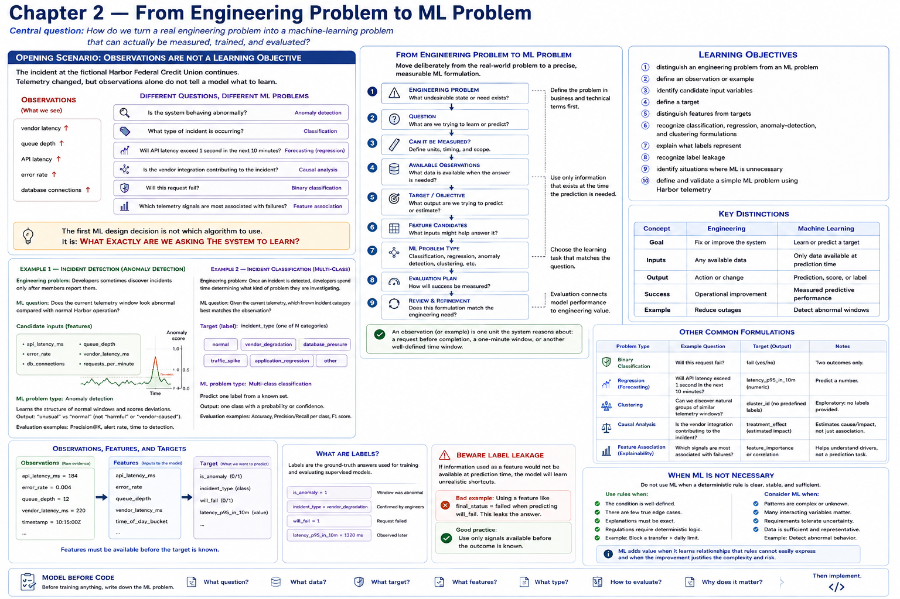

# Chapter 2 — From Engineering Problem to ML Problem

[← Chapter 1](chapter-01-the-digital-banking-data-landscape.md) · [Part I contents](README.md) · [Book contents](../../CONTENTS.md) · [Chapter 3 →](chapter-03-the-machine-learning-pipeline.md)




> **Central question:** How do we turn a real engineering problem into a machine-learning problem that can actually be measured, trained, and evaluated?

## Opening scenario: observations are not a learning objective

The incident at the entirely fictional **Harbor Federal Credit Union** continues. Chapter 1 assembled time-aligned telemetry. Several measurements changed:

```text
vendor latency ↑
queue depth ↑
API latency ↑
error rate ↑
database connections ↑
```

Those are observations. They establish what instruments recorded, but they do not tell a model what to learn. The same evidence could prompt very different questions:

```text
Is the system behaving abnormally?

What type of incident is occurring?

Will API latency exceed 1 second in the next 10 minutes?

Is the vendor integration contributing to the incident?

Will this request fail?

Which telemetry signals are most associated with failures?
```

One question asks about unusual structure, another about a category, another about a future threshold, and another about an individual request. “Contributing” may require causal evidence rather than prediction, while “associated” is exploratory analysis. Sharing a dataset does not make these interchangeable.

> **The first ML design decision is not which algorithm to use.**
>
> It is: **What exactly are we asking the system to learn?**

The existence of data does not make ML appropriate. First understand the engineering problem; then decide whether it can be stated as a measurable learning problem.

## Learning objectives

By the end of this chapter, you should be able to:

1. distinguish an engineering problem from an ML problem;
2. define an observation or example;
3. identify candidate input variables;
4. define a target;
5. distinguish features from targets;
6. recognize classification, regression, anomaly-detection, and clustering formulations;
7. explain what labels represent;
8. recognize label leakage;
9. identify situations where ML is unnecessary; and
10. define and validate a simple ML problem using Harbor telemetry.

No model is trained in this chapter. The executable work makes the question precise before later code learns anything.

## Start with the engineering question

An **engineering problem** describes an undesirable state, unmet need, or opportunity in the system. An **ML problem** specifies the observations, desired output, timing, and evaluation needed to learn a statistical relationship. Move deliberately between them:

```text
ENGINEERING PROBLEM
        │
        ▼
QUESTION
        │
        ▼
CAN IT BE MEASURED?
        │
        ▼
AVAILABLE OBSERVATIONS
        │
        ▼
TARGET / OBJECTIVE
        │
        ▼
FEATURE CANDIDATES
        │
        ▼
ML PROBLEM TYPE
        │
        ▼
EVALUATION PLAN
```

At “can it be measured?”, define units, timing, and scope. At “available observations,” ask what is present **when the answer is needed**, not merely what appears eventually in storage. An **observation** or **example** is one unit the proposed system reasons about: a request before completion, a one-minute telemetry row, or a ten-minute window. Its boundary must be explicit.

An evaluation plan belongs in the formulation even before choosing an algorithm. Harbor might ask how performance changes over time and what false alarms or missed incidents cost. A numerical score without a connection to the engineering need cannot establish usefulness.

### Example 1 — Incident detection

**Engineering problem:** Developers sometimes discover incidents only after members report them.

**Possible ML question:** Does the current telemetry window look abnormal compared with normal Harbor operation?

Candidate inputs include:

```text
api_latency_ms
error_rate
db_connections
queue_depth
vendor_latency_ms
requests_per_minute
```

This is **anomaly detection**. It can be useful when Harbor has plentiful normal telemetry but few reliable incident labels. A method could learn or summarize the structure of ordinary windows and score deviations. The output says “unusual,” not “harmful” or “vendor-caused.” Maintenance and a legitimate traffic peak may also be unusual, so engineers must evaluate alerts and investigate context.

### Example 2 — Incident classification

**Engineering problem:** Once an incident is detected, developers spend time determining what kind of problem they are investigating.

**Possible ML question:** Given the current telemetry, which known incident category best matches the observation?

The target could be `incident_type`, with possible values:

```text
normal
vendor_degradation
database_pressure
traffic_spike
application_regression
```

This is **multi-class classification**: one output is selected from more than two known categories. Some later algorithms handle all classes directly; others combine binary comparisons, such as one-versus-rest. That implementation choice does not change this formulation. Harbor still needs clearly defined categories, labeled examples, and evaluation across every class. A predicted category prioritizes investigation; it does not establish root cause.

### Example 3 — Latency prediction

**Engineering problem:** Developers would benefit from warning before member-facing latency becomes severe.

**Possible question:** What will Harbor's API latency be 10 minutes from now?

The target is `future_api_latency_ms`. Because the desired output is a numerical quantity, this is **regression**. Its observation time and forecast horizon matter: inputs must end at time *t*, while the label describes latency at *t* + 10 minutes. “Will latency exceed 1 second?” would instead turn the same operational need into binary classification, demonstrating that wording changes the learning problem.

### Example 4 — Request failure prediction

**Engineering problem:** Some vendor-backed requests are more likely to fail than others.

**Possible question:** Will this request fail?

The target is `request_failed`:

```text
0 = success
1 = failure
```

This is **binary classification**. One observation represents one request at a specified prediction moment. Harbor must define “failure”—for example, a terminal unsuccessful response within a time boundary—before labels can be consistent.

## Features and targets

Supervised-learning material conventionally uses:

```text
X = input features
y = target
```

A **feature** is a variable deliberately supplied to a model. The feature collection `X` represents what the model knows when making a prediction. The **target** `y` is the answer it should learn to predict from historical examples.

```text
X

api_latency_ms
vendor_latency_ms
queue_depth
db_connections
retry_count

        │
        ▼

MODEL

        │
        ▼

y

request_failed
```

A small table makes the separation visible:

```text
vendor_latency  queue_depth  db_connections  retry_count  request_failed
220             12           31              0            0
235             14           32              0            0
620             26           38              1            0
1410            71           61              2            1
1760            109          79              3            1
1900            147          96              4            1
```

For this formulation, the first four columns make up `X`; the last column is `y`:

```text
X = everything the model receives as input
y = the answer we want the model to learn to predict
```

Not every stored column belongs in `X`. A timestamp may define ordering but require an intentional transformation before use. An identifier may help join records but offer no generalizable signal. Sensitive or unnecessary data should be excluded. Outcome fields and facts recorded after prediction time must be excluded.

## Labels and supervised examples

A **label** is the known outcome attached to an example in supervised learning. In this context, label and target refer to closely related views: the target defines which outcome the problem predicts; a label is the known target value on a particular historical row.

```text
telemetry observation
        +
known incident outcome
        =
labeled example
```

For example:

```python
{
    "vendor_latency_ms": 1900,
    "queue_depth": 147,
    "db_connections": 96,
    "retry_count": 4,
    "incident_type": "vendor_degradation",
}
```

Here the features are `vendor_latency_ms`, `queue_depth`, `db_connections`, and `retry_count`; the label is the row's `incident_type` value.

In a real engineering environment, labels might be derived—with governance and review—from:

- incident records;
- postmortems;
- support classifications;
- operational annotations;
- known test scenarios; or
- deterministic simulations.

Labels are recorded judgments or outcomes, not unquestionable truth. Inconsistent incident taxonomy, missing incidents, delayed support categorization, and ambiguous outcomes affect what can be learned. Harbor's repository fixtures are instead small, fictional, deterministic teaching aids. They do not claim to represent real banking distributions.

Anomaly detection and clustering can be **unsupervised**: their training observations do not require a supplied outcome column. Evaluation still requires engineering judgment and some reference evidence. “No training target” does not mean “no need to validate.”

## Prediction time and label leakage

Ask this before accepting any feature:

> **What information would actually be available at the moment the prediction is made?**

Suppose the question is “Will this request fail?” This definition is invalid:

```text
FEATURES

vendor_latency_ms
retry_count
final_http_status
request_failed

TARGET

request_failed
```

The answer has leaked into the inputs. **Label leakage** occurs when training features contain the target itself or information that would not legitimately exist at prediction time and reveals the outcome.

```text
BEFORE REQUEST COMPLETES

vendor
endpoint
current_vendor_latency
queue_depth
recent_error_rate
        │
        ▼
      MODEL
        │
        ▼
Will request fail?


AFTER REQUEST COMPLETES

final_status_code
failure_reason
request_failed

These cannot be used to predict an outcome
that has already happened.
```

A model using `request_failed` can copy its answer. A model using `final_status_code` may infer nearly the same answer. Offline evaluation can therefore look deceptively excellent, yet the model is unusable at the intended prediction moment. Leakage can also be subtler: a post-incident annotation, a retry total counted after completion, or an aggregate whose time window reaches into the future.

The Chapter 2 validator detects only the obvious structural case where the target name also appears among features. It cannot understand business timing or discover proxy leakage. Humans must document how each feature is produced, its event time, its availability time, and the prediction cutoff.

## When not to use machine learning

Many important banking application behaviors should remain ordinary deterministic software:

```text
Is the member authenticated?
→ deterministic security rule

Does the account have permission to perform this operation?
→ deterministic authorization rule

Is a required field missing?
→ validation

Did the vendor return HTTP 503?
→ direct observation

Is error_rate > 5%?
→ simple threshold rule

Does a complex combination of telemetry resemble
historical incidents?
→ potentially useful ML problem
```

Rules are preferable when requirements are explicit, correctness is defined exactly, or the system must enforce policy rather than estimate a pattern. Directly observe known facts. Do not predict what a status code already tells you. A threshold may be sufficient, easier to explain, and cheaper to operate.

```text
Can explicit rules solve the problem reliably?
        │
       YES
        │
        ▼
USE NORMAL SOFTWARE


       NO
        │
        ▼
Are historical examples or meaningful patterns available?
        │
       YES
        │
        ▼
CONSIDER MACHINE LEARNING
```

A “no” to meaningful examples is not permission to fabricate certainty; improve instrumentation, clarify outcomes, run deterministic scenarios, or retain the existing workflow. “Consider” is not “automatically adopt.” Compare an ML approach with a simple baseline and its operational purpose.

ML adds costs:

- training and reproducibility;
- evaluation against relevant cases;
- production monitoring;
- model drift as behavior changes;
- explainability and investigation burden;
- false positives that create noise;
- false negatives that miss events; and
- operational complexity, ownership, and failure handling.

The existence of an ML technique does not justify using it. Its measured benefit must exceed these costs, and it must not replace deterministic security, authorization, accounting, or transaction controls.

## Problem formulation table

| Harbor engineering question | ML formulation | Possible target |
| --- | --- | --- |
| Does current telemetry look unusual? | anomaly detection | none required |
| What incident type is occurring? | multi-class classification | `incident_type` |
| Will this request fail? | binary classification | `request_failed` |
| What will latency be in 10 minutes? | regression | `future_latency_ms` |
| Are there natural groups of system behavior? | clustering | none required |

The three rows with targets are **supervised** formulations: historical examples pair inputs with known answers. Classification predicts discrete categories; regression predicts a numerical value. The anomaly-detection and clustering rows shown here are **unsupervised**: they seek unusual observations or groups without supplied targets. These names describe objectives, not guarantees that the resulting patterns will be operationally meaningful.

## Executable laboratory: definitions before models

`src/harbor_ml/problem_framing.py` encodes a problem as an immutable `MLProblem`:

```python
class ProblemType(Enum):
    BINARY_CLASSIFICATION = "binary_classification"
    MULTICLASS_CLASSIFICATION = "multiclass_classification"
    REGRESSION = "regression"
    ANOMALY_DETECTION = "anomaly_detection"
    CLUSTERING = "clustering"


@dataclass(frozen=True)
class MLProblem:
    name: str
    engineering_question: str
    problem_type: ProblemType
    features: tuple[str, ...]
    target: str | None
```

The module defines request-failure classification, incident classification, future-latency regression, and telemetry anomaly detection. For example:

```python
REQUEST_FAILURE = MLProblem(
    name="Request failure prediction",
    engineering_question="Will this vendor-backed request fail?",
    problem_type=ProblemType.BINARY_CLASSIFICATION,
    features=(
        "vendor_latency_ms",
        "queue_depth",
        "db_connections",
        "retry_count",
    ),
    target="request_failed",
)
```

Construction deterministically rejects:

- an empty feature collection;
- duplicate feature names;
- a target included in the feature collection;
- a supervised problem without a target; and
- an unsupervised problem with a target.

The rule against a target in features produces an educational error such as:

```text
Invalid ML problem: target 'request_failed' cannot also appear in the feature set.
```

A constructed instance is already valid. Its `validate()` method makes that step explicit in the command-line lesson; it does not train, score, or mutate anything.

### The labeled fixture

[`data/harbor_request_outcomes.csv`](../../data/harbor_request_outcomes.csv) contains 30 chronological, fictional request observations with this exact schema:

```text
timestamp
vendor_latency_ms
queue_depth
db_connections
retry_count
request_failed
```

Both `0` and `1` labels appear, and a few outcomes deliberately break an overly neat latency-to-failure pattern. The fixture is designed to make features and labels visible—not to be statistically realistic, production-sized, or representative of any banking population. `load_request_outcomes` checks its schema, parses typed values, requires chronological timezone-aware timestamps, validates nonnegative measurements, and restricts the label to `0` or `1`.

### Run the example

From the repository root:

```bash
python examples/chapter_02_problem_framing.py
```

The example prints each problem's question, type, features, target, and validation result. It ends with intentionally invalid teaching material:

```text
Leakage demonstration (intentionally invalid teaching material)

Features:
- vendor_latency_ms
- request_failed

Target:
request_failed

Validation:
FAILED

Reason:
Invalid ML problem: target 'request_failed' cannot also appear in the feature set.
```

The exception is expected and caught. The program exits normally. No estimator, optimization procedure, or trained model exists in this chapter.

Run the focused and complete checks:

```bash
pytest tests/test_problem_framing.py
pytest
```

Tests cover valid definitions, all supervised/unsupervised type behavior, target requirements, duplicate and empty features, obvious leakage, typed fixture parsing, chronological structure, both binary outcomes, and invalid labels.

## Connect the formulation to mathematics

A supervised problem is often summarized as:

```text
f(X) ≈ y
```

- `X` represents information available to the model;
- `f` represents the relationship a future training algorithm learns; and
- `y` represents the desired prediction.

The approximation symbol is important. A learned relationship is not an exact business rule or guaranteed answer. With several request observations:

```text
X =
[
  [220, 12, 31, 0],
  [620, 26, 38, 1],
  [1410, 71, 61, 2],
  ...
]

y =
[
  0,
  0,
  1,
  ...
]
```

```text
rows    → examples / observations
columns → features
y       → known outcomes
```

The first row says that one historical request had vendor latency 220 ms, queue depth 12, 31 database connections, zero retries, and outcome label 0. Column order must remain consistent. Later chapters will represent such structures with data libraries and feed them to algorithms. For now, the purpose is only to identify what each dimension means and when it is knowable.

## Exercises

### Exercise 1 — Classify the question

Choose binary classification, regression, anomaly detection, multi-class classification, or clustering, and explain why:

```text
Will the request fail?
What will latency be?
Does this telemetry look abnormal?
What incident category is this?
Are there natural groups of member-session behavior?
```

State whether each formulation requires labels. For member-session analysis, also state what privacy review and interpretation limits would be needed; a cluster is not a statement about a person's intent.

### Exercise 2 — Specify an observation

For “Will this vendor-backed request fail?”, identify:

- the observation and the exact prediction moment;
- possible features available then;
- the target and a precise definition of failure; and
- the problem type.

Explain how a row becomes a labeled example only after its outcome is known.

### Exercise 3 — Find the leakage

Review:

```text
features:
vendor_latency_ms
queue_depth
retry_count
final_http_status

target:
request_failed
```

Why might `final_http_status` be unavailable at prediction time? Could `retry_count` also leak if it means the final rather than current count? Rewrite the feature definitions with explicit cutoff times.

### Exercise 4 — Is ML necessary?

For each task, choose deterministic software, a possible ML-assisted formulation, or further clarification. Justify the cost:

```text
Reject an API request without authentication.

Alert when queue_depth > 100.

Recognize unusual combinations of six operational metrics.

Predict API latency ten minutes into the future.
```

Name a baseline and one consequence each of a false positive and false negative where ML is plausible.

### Coding exercise — Future queue pressure

Add this definition:

> Will Harbor's queue depth exceed 100 within the next five minutes?

Determine:

- its problem type;
- candidate features;
- a target name and exact label rule; and
- which information is available at prediction time.

Implement and validate the `MLProblem`, add it to an appropriate collection, and extend the tests. Do not calculate labels from future rows inside a prediction-time feature and do not train a model.

## Key takeaways

1. Start with the engineering problem, not the algorithm.
2. Define exactly what is being predicted and what one observation represents.
3. Features are information available to the model at prediction time.
4. The target is what supervised learning attempts to predict; its known per-example value is a label.
5. Information unavailable at prediction time cannot legitimately be used as a feature.
6. Leakage can make a bad or unusable model look excellent.
7. Some engineering problems should remain deterministic.
8. ML may help when meaningful patterns are too complex to express reliably with explicit rules, but its value must be evaluated against its costs.

## What comes next

The reader now understands:

```text
engineering problem
       ↓
ML question
       ↓
features
       ↓
target
       ↓
problem type
```

Chapter 3 — **The Machine Learning Pipeline** — will ask:

> How do we go from historical examples to a trained model that can make predictions on new observations?

```text
DATA
 │
 ▼
PREPARE
 │
 ▼
SPLIT
 │
 ├────► TRAINING DATA
 │
 └────► TEST DATA
          │
          ▼
        MODEL
          │
          ▼
      EVALUATION
```

Continue to Chapter 3 for that complete, executable pipeline. Chapter 2 itself trains no model.
