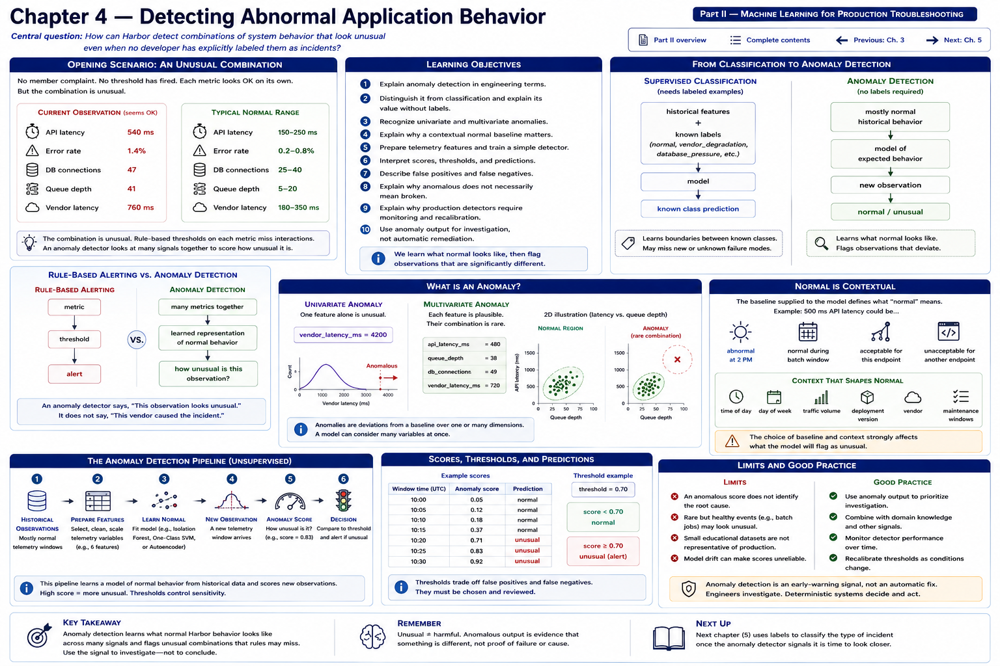

# Chapter 4 — Detecting Abnormal Application Behavior



> Part II — Machine Learning for Production Troubleshooting

[Part II overview](README.md) · [Complete contents](../../CONTENTS.md) · [Previous: Chapter 3](../part-01-ml-assisted-engineering/chapter-03-the-machine-learning-pipeline.md) · [Next: Chapter 5](chapter-05-incident-classification.md)

## Central question

> How can Harbor detect combinations of system behavior that look unusual even when no developer has explicitly labeled them as incidents?

It is another weekday morning at **Harbor Federal Credit Union**. No member complaint has arrived. No deterministic threshold has fired. Viewed separately, the measurements appear acceptable:

```text
API latency          540 ms
error rate           1.4%
DB connections       47
queue depth          41
vendor latency       760 ms
```

None necessarily crosses a critical operational limit. Ordinary Harbor observations, however, have tended to resemble:

```text
API latency          150–250 ms
error rate           0.2–0.8%
DB connections       25–40
queue depth          5–20
vendor latency       180–350 ms
```

The *combination* is unusual. A developer can add a threshold for each metric, but interactions become difficult to enumerate as signals and contexts multiply.

```text
RULE-BASED ALERTING

metric
  │
  ▼
threshold
  │
  ▼
alert

ANOMALY DETECTION

many metrics together
        │
        ▼
learned representation of normal behavior
        │
        ▼
how unusual is this observation?
```

An anomaly detector says, **“This observation looks unusual.”** It does not necessarily say, **“This vendor caused the incident.”** That distinction guides the entire chapter.

## Learning objectives

By the end, you should be able to:

1. explain anomaly detection in engineering terms;
2. distinguish it from classification and explain its value without labels;
3. recognize univariate and multivariate anomalies;
4. explain why a contextual normal baseline matters;
5. prepare telemetry features and train a simple detector;
6. interpret scores, thresholds, and predictions;
7. describe false positives and false negatives;
8. explain why anomalous does not necessarily mean broken;
9. explain why production detectors require monitoring and recalibration; and
10. use anomaly output for investigation, not automatic remediation.

## From classification to anomaly detection

Chapter 3 used supervised learning:

```text
SUPERVISED CLASSIFICATION

historical features
        +
known labels
        │
        ▼
model
        │
        ▼
known class prediction
```

Labels could name `normal`, `vendor_degradation`, `database_pressure`, or `traffic_spike`. The model learns boundaries between classes developers have defined and labeled. Harbor often has abundant ordinary telemetry but few reliable incident labels. New failure modes may not fit any known class.

```text
ANOMALY DETECTION

mostly normal historical behavior
        │
        ▼
model of expected behavior
        │
        ▼
new observation
        │
        ▼
normal / unusual
```

Here the engineering formulation is: **learn what normal operation tends to look like, then identify observations that differ significantly from that pattern.** This can surface behavior outside known incident categories and start an earlier investigation. It neither invents a label nor explains the difference.

## What is an anomaly?

An anomaly is not merely “a high number.” It is an observation that is unusual relative to a chosen baseline.

### Univariate anomaly

```text
vendor_latency_ms = 4200
```

One feature alone may make this observation conspicuous. A transparent threshold might handle it perfectly well.

### Multivariate anomaly

```text
api_latency_ms      = 480
queue_depth         = 38
db_connections      = 49
vendor_latency_ms   = 720
```

Each value might be plausible on its own. Their joint occurrence may be rare:

```text
NORMAL REGION

latency
   │
   │          ● ●
   │       ● ● ● ●
   │      ● ● ● ●
   │        ● ●
   │
   └──────────────── queue depth

ANOMALY

latency
   │
   │          ● ●
   │       ● ● ● ●
   │      ● ● ● ●
   │        ● ●
   │
   │                          X
   └──────────────────────────── queue depth
```

A page can show two dimensions. A model can consider six or more at once. That capability is useful, but it does not guarantee that every operationally important combination will be detected.

## Normal is contextual

**The baseline supplied to the model defines its evidence about normality.** Consider `500 ms API latency`. It could be:

- abnormal at 2 PM under ordinary traffic;
- normal during a scheduled batch process;
- acceptable for one endpoint; or
- unacceptable for another endpoint.

Potential context includes endpoint, time of day, weekday, deployment version, traffic volume, vendor, and maintenance windows. This laboratory does not implement separate models or contextual features for all of them. Its baseline represents one simplified operating regime. A production team might segment baselines, encode useful context, suppress known maintenance windows, or use time-aware techniques.

If Harbor trains only on weekday mornings, a healthy weekend pattern may look anomalous. If degraded periods leak into the baseline, the detector may learn degradation as ordinary. Deployments, traffic growth, and vendor changes create **drift**: normal changes over time. Engineers must monitor alert volume and score distributions, review outcomes, refresh data deliberately, and recalibrate thresholds. “Train once” is not an operating plan.

## The fictional datasets

[`harbor_normal_telemetry.csv`](../../data/harbor_normal_telemetry.csv) contains 200 deterministic synthetic observations. It is entirely fictional educational data and is not intended to model real financial-system distributions. Its columns are:

```text
timestamp
api_latency_ms
error_rate
db_connections
queue_depth
vendor_latency_ms
requests_per_minute
```

The baseline intentionally contains ordinary variation and no incident labels. [`harbor_anomaly_scenarios.csv`](../../data/harbor_anomaly_scenarios.csv) is kept separate and contains two normal checks plus vendor-latency, queue-growth, broad-pressure, and subtle multivariate scenarios. It is evaluation material, not training data.

The subtle scenario uses moderately elevated values together:

```text
api_latency_ms      = 430
error_rate          = 0.012
db_connections      = 48
queue_depth         = 36
vendor_latency_ms   = 650
requests_per_minute = 620
```

No one value must be extraordinarily high for the joint pattern to differ from the baseline. This is where multivariate detection *can* add value over a single threshold; it is not a promise that every algorithm will detect every subtle case.

## Preparing features

```text
RAW TELEMETRY
     │
     ▼
SELECT NUMERICAL FEATURES
     │
     ▼
X
     │
     ▼
ANOMALY DETECTOR
```

The timestamp gives provenance but is not directly included in `X`. The explicit feature tuple prevents a CSV column or scenario label from silently becoming a model input. `build_anomaly_features` preserves this declared order and returns a 200-by-6 NumPy matrix.

We do not scale these features. Isolation Forest partitions each feature by values within that feature; unlike Chapter 3's distance/optimization considerations, differently expressed units do not by themselves require standardization here. Scaling might still belong in another algorithm or broader pipeline. Avoid copying a preprocessing step without an engineering reason.

## Isolation Forest

This chapter uses scikit-learn's `IsolationForest`. At a high level, it repeatedly partitions observations. Observations that are easier to isolate from the rest tend to receive more anomalous scores.

```text
normal cluster

● ● ● ● ●
 ● ● ● ●
● ● ● ● ●

far observation

                         X

X tends to be easier to isolate.
```

It is useful pedagogically because it handles multiple numerical features, needs no incident labels, exposes scores, ships with scikit-learn, and fits a small pipeline. **This is an educational choice, not a claim that Isolation Forest is the best production algorithm for banking telemetry.** Alternatives and production evaluation depend on the data, latency, interpretability, drift, and operational cost.

The constructor is intentionally explicit:

```python
IsolationForest(contamination=0.05, random_state=42)
```

`random_state=42` makes random partitions reproducible. `contamination=0.05` tells scikit-learn the assumed fraction used to place its decision threshold. This modest value is a teaching assumption, not a value tuned merely to force the scenarios to pass and **not Harbor's true production incident rate**. Baseline contamination and the desired alert rate would require evidence and operational validation.

## The implementation

[`src/harbor_ml/anomaly_detection.py`](../../src/harbor_ml/anomaly_detection.py) keeps responsibilities visible:

- `load_normal_telemetry` and `load_anomaly_scenarios` parse and validate fixtures;
- `build_anomaly_features` performs ordered selection;
- `build_anomaly_detector` creates an unfitted estimator;
- `train_anomaly_detector` validates and fits `X`;
- `score_observation` validates a new mapping and returns `AnomalyResult`.

Training has no `y`: there are no incident targets. Scenario names and timestamps never enter the feature matrix.

### Scores are not probabilities

The flow is:

```text
raw telemetry
    ↓
anomaly score
    ↓
threshold
    ↓
normal / anomaly classification
```

scikit-learn's `decision_function` is positive on the normal side of its learned cutoff and negative on the anomaly side. The chapter returns its **negative**:

```python
score = -float(detector.decision_function(row)[0])
```

Consequently, larger chapter scores mean “more unusual,” and a score above zero is on the anomalous side of this fitted model's threshold. `predict` returns `1` for an inlier and `-1` for an outlier; `score_observation` converts `-1` to `is_anomaly=True`.

The sign flip is only a readability transformation. The result is **not a calibrated probability**, risk percentage, severity, or expected incident rate. Scores are most meaningful relative to the same model and baseline.

A binary flag loses information: observation A and observation B might both be `anomaly` while B has a substantially more unusual score. Dashboards can retain the score for prioritization without pretending it is a probability.

## Run the laboratory

From the repository root:

```bash
python examples/chapter_04_anomaly_detection.py
```

The program loads all 200 baseline rows, builds and fits the actual estimator, then computes every displayed score from the named scenario's features. Nothing hard-codes classifications or printed scores. Run it twice: the fixed fixture and `random_state` make the output reproducible.

Read the result as an investigative signal. For example, the vendor scenario's flag means its six-feature combination is outside the learned region—not that a vendor has been proved responsible.

## Thresholds and anomaly detection coexist

Chapter 0's deterministic approach remains transparent and valuable:

```python
if error_rate > 0.05:
    alert()
```

It is appropriate for known safety limits, capacities, and service objectives. The detector considers error rate, latency, queue, database pressure, vendor latency, and traffic **together**. It can complement rather than replace guardrails:

```text
DETERMINISTIC GUARDRAILS
          +
ANOMALY DETECTION
          +
HUMAN INVESTIGATION
```

A model must never weaken authorization, accounting, transaction-integrity, security, or other deterministic controls.

## Errors and operational trade-offs

### False positive

> The model flags normal operation as anomalous.

This causes unnecessary investigation, alert fatigue, and declining trust. A legitimate promotion or a newly introduced healthy workload may be unusual relative to an old baseline.

### False negative

> The model treats genuinely unusual behavior as normal.

This can delay incident detection or miss an early warning. A baseline polluted with degraded observations, a poorly represented context, or a threshold chosen to suppress alerts can contribute.

No magical threshold eliminates both. Moving a cutoff generally exchanges one cost for the other. Teams need reviewed cases, operational objectives, and later evaluation methods—not confidence based on a few attractive examples.

# Anomaly detection is not root-cause analysis

```text
MODEL OUTPUT

Current telemetry is highly unusual.

NOT:

The identity vendor is definitely broken.
```

A developer might investigate vendor latency, a recent deployment, database load, a traffic spike, network conditions, queue behavior, and dependent services. Correlated movements can have a common upstream cause or cascade in either direction. The detector narrows attention; traces, logs, change history, dependency evidence, and engineering experiments establish better explanations.

For that reason, an anomaly flag must not directly restart services, reroute transactions, disable functionality, or alter member-facing behavior in this teaching design. Remediation requires explicit policy and human judgment.

## A possible future architecture

```text
                  HARBOR APPLICATIONS
                         │
                         ▼
                logs / metrics / events
                         │
                         ▼
                  telemetry pipeline
                         │
                         ▼
                anomaly detector
                         │
                         ▼
              anomaly score / flag
                         │
                         ▼
                monitoring dashboard
                         │
                         ▼
                    developer
                         │
                         ▼
                   investigation
```

This chapter implements the offline detector and laboratory only. It does not implement streaming ingestion, a dashboard, automatic remediation, production monitoring, or Chapter 5.

## Exercises

### Exercise 1 — Classification or anomaly detection?

Choose the more appropriate formulation and state what training evidence it requires:

```text
Which known incident category is occurring?
Does this system behavior look unlike normal operation?
Will this request fail?
Has Harbor seen telemetry like this before?
```

Distinguish classification from anomaly detection even when both eventually display a label.

### Exercise 2 — Individual versus multivariate anomaly

Compare (a) vendor latency of 4,200 ms while everything else is ordinary and (b) six individually plausible measurements that have rarely occurred together. Which is more likely to require multivariate analysis? Which might be handled more transparently by a threshold? Explain.

### Exercise 3 — Investigate the anomaly

A flag contains `api_latency_ms=510`, `queue_depth=42`, `db_connections=50`, and `vendor_latency_ms=700`. **What would you investigate next?** Provide at least three competing hypotheses and one item of evidence that could support or weaken each. Do not treat the flag as a root-cause label.

### Exercise 4 — Anomaly does not mean failure

A new Harbor promotion causes a large but legitimate traffic spike. Requests remain successful and dependencies remain healthy. Why might the model correctly call this unusual even though nothing is broken? What contextual update or review process should follow?

### Coding exercise — `traffic_spike`

Add a fictional scenario with high `requests_per_minute`, moderately elevated `api_latency_ms`, low `error_rate`, and healthy `vendor_latency_ms`. Load and score it using the existing detector—do not hard-code an expected result. Explain separately:

1. Does this fitted model consider it unusual?
2. Is the system necessarily unhealthy?

Those are deliberately different questions. Add a non-brittle test for type and finite score before deciding whether a fixed classification assertion is justified.

## Key takeaways

1. Anomaly detection looks for unusual patterns rather than known incident labels.
2. Anomalies can involve combinations of otherwise plausible values.
3. Normal behavior must be defined by an appropriate baseline.
4. The model knows only the data supplied to it.
5. Anomaly scores are not automatically probabilities.
6. Unusual does not necessarily mean broken.
7. Anomaly detection does not identify root cause by itself.
8. Deterministic thresholds and ML can coexist.
9. False positives and false negatives have operational consequences.
10. Its best use is often helping developers decide where and when to investigate.

## What comes next

Chapter 5 — **Incident Classification** will ask a different question. The anomaly detector answers:

> Does this look unusual?

Once Harbor knows an incident is occurring, developers may ask:

> What kind of incident does this most resemble?

Possible known categories include:

```text
vendor_degradation
database_pressure
traffic_spike
application_regression
```

```text
ANOMALY DETECTION
Is something unusual?
        │
        ▼
INCIDENT CLASSIFICATION
What kind of known incident does it resemble?
```

Continue to [Chapter 5 — Incident Classification](chapter-05-incident-classification.md) to train and evaluate a multi-class model over known, fictional incident patterns.
