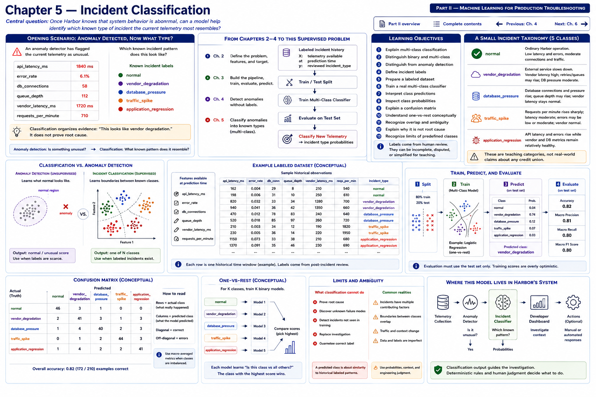

# Chapter 5 — Incident Classification



> Part II — Machine Learning for Production Troubleshooting

[Part II overview](README.md) · [Complete contents](../../CONTENTS.md) · [Previous: Chapter 4](chapter-04-detecting-abnormal-application-behavior.md)

## Central question

> Once Harbor knows that system behavior is abnormal, can a model help identify which known type of incident the current telemetry most resembles?

The anomaly detector at **Harbor Federal Credit Union** has flagged the current telemetry as unusual:

```text
api_latency_ms      = 1840
error_rate          = 0.061
db_connections      = 58
queue_depth         = 112
vendor_latency_ms   = 1720
requests_per_minute = 710
```

The immediate question is no longer only, “Is this unusual?” The developer asks, **“Which known incident pattern does this resemble?”** Harbor has fictional historical records labeled:

```text
normal
vendor_degradation
database_pressure
traffic_spike
application_regression
```

A supervised classifier can learn relationships between telemetry and those labels:

```text
CURRENT TELEMETRY
       │
       ▼
INCIDENT CLASSIFIER
       │
       ▼
class probabilities
       │
       ▼
most likely known class
       │
       ▼
developer investigation
```

The useful statement is, **“This observation most resembles historical vendor-degradation scenarios.”** It is not, **“The vendor is definitely the root cause.”** Classification organizes evidence; it does not prove causality or complete an investigation.

```text
ANOMALY DETECTION
Is something unusual?
        │
        ▼
INCIDENT CLASSIFICATION
What known incident pattern does it resemble?
```

## Learning objectives

By the end, you should be able to:

1. explain multi-class classification;
2. distinguish binary and multi-class classification;
3. distinguish classification from anomaly detection;
4. define incident labels;
5. prepare a labeled multi-class dataset;
6. train a real multi-class classifier;
7. interpret class predictions;
8. inspect class probabilities;
9. explain a confusion matrix for multiple classes;
10. understand one-vs-rest conceptually;
11. recognize class overlap and ambiguous incidents;
12. explain why a predicted class is not proven root cause; and
13. recognize the limitation of models that know only predefined classes.

## From Chapters 2–4 to a new supervised problem

Chapter 2 required a precise target and prediction-time features. Chapter 3 separated `X` from `y`, split labeled history, trained a classifier, evaluated held-out observations, and performed inference. Chapter 4 did not need incident labels: its Isolation Forest learned a baseline and asked whether telemetry was unusual.

Chapter 5 returns to the Chapter 3 supervised pipeline, but `y` now has five values:

```text
labeled incident history
          │
          ├── X: telemetry available at prediction time
          └── y: reviewed incident_type
                         │
                         ▼
               train/test split
                         │
                         ▼
                 train classifier
                         │
                         ▼
              held-out evaluation
                         │
                         ▼
             classify new telemetry
```

The label quality matters. A post-incident reviewer may choose a simplified teaching label, but production incident records can be incomplete, disputed, or contain several contributing conditions. A model learns that labeling process as well as telemetry patterns.

## A deliberately small incident taxonomy

This chapter uses five balanced teaching categories. They are fictional, simplified, and **not a claim about any real credit union's taxonomy or incident distribution**.

### `normal`

Typical Harbor operating behavior: relatively low latency and errors, moderate connections and traffic, and shallow queues. Including `normal` lets the classifier describe known ordinary behavior, although Chapter 4's detector remains the tool designed specifically to assess unusualness.

### `vendor_degradation`

An external dependency slows down. Vendor latency rises; retry-associated queue effects and Harbor API latency may rise; database pressure may remain moderate. The dataset does not include retry count, so vendor latency is the clearest dependency signal available here.

### `database_pressure`

Database connections and query-related pressure rise, queue depth may rise, and vendor latency stays relatively ordinary. In a real investigation, connections alone would not establish whether slow queries, locks, capacity, or application behavior caused the pressure.

### `traffic_spike`

Requests per minute rise sharply, API latency may rise moderately, errors can remain low or moderate, and vendor latency may stay normal. A traffic spike can be healthy demand rather than a failure.

### `application_regression`

Harbor API latency and errors rise while vendor and database measurements may remain comparatively healthy. A recent deployment would be useful context, but this laboratory deliberately uses only the six signals already established. Therefore the label suggests resemblance, not proof that application code regressed.

Real incidents overlap. Vendor slowness can fill queues and consume database connections; a traffic spike can expose a query problem; a deployment can change dependency traffic. A single label compresses that complexity.

## Binary versus multi-class classification

Chapter 3's target was binary:

```text
BINARY

request_failed

0 = success
1 = failure
```

The new target has more than two possible values:

```text
MULTI-CLASS

incident_type

normal
vendor_degradation
database_pressure
traffic_spike
application_regression
```

Both are supervised classification because examples have known labels. “Binary” and “multi-class” describe the number of target choices:

```text
X
│
▼
MODEL
│
▼
one of several classes
```

Anomaly detection is different. The Chapter 4 detector learned normal structure without a reviewed incident category for every row. Its normal/anomaly output may look binary, but its learning formulation and question differ from supervised binary classification.

## One-vs-rest as a mental model

One way to understand multi-class classification is to imagine one binary question per class. For four incident categories, omitting `normal` only to keep this diagram compact:

```text
Classifier 1:
vendor_degradation vs everything else

Classifier 2:
database_pressure vs everything else

Classifier 3:
traffic_spike vs everything else

Classifier 4:
application_regression vs everything else
```

Then:

```text
new observation
       │
       ▼
class scores / probabilities
       │
       ▼
highest-supported class
```

This is the **one-vs-rest** concept. Different algorithms and scikit-learn versions can handle multi-class decisions internally in different ways. Logistic regression can fit a joint multi-class decision rather than requiring application code to construct those four estimators. The developer ordinarily calls `fit`, `predict`, and `predict_proba`; the conceptual comparison helps explain why every observation receives support for several candidate classes, not why Harbor should manually maintain four classifiers.

## The fictional dataset

[`harbor_incident_classes.csv`](../../data/harbor_incident_classes.csv) contains 300 deterministic synthetic rows—60 per class. A fixed seed produced overlapping distributions and stable examples. This balance supports a clear stratified-split exercise; it does **not** estimate real incident prevalence.

```text
timestamp
api_latency_ms
error_rate
db_connections
queue_depth
vendor_latency_ms
requests_per_minute
incident_type
```

`timestamp` identifies the historical observation but is not a feature in this exercise. The six numeric measurements are available when Harbor performs inference. `incident_type` is the reviewed historical target:

```text
X = api_latency_ms, error_rate, db_connections,
    queue_depth, vendor_latency_ms, requests_per_minute

y = incident_type
```

Putting `incident_type` in `X` would leak the answer into training. The fixture intentionally adds noise and overlap. Perfect separation and 100% held-out accuracy are not goals.

## Implementation

The focused implementation is [`incident_classifier.py`](../../src/harbor_ml/incident_classifier.py). Its declared order is part of the feature contract:

```python
INCIDENT_FEATURES = (
    "api_latency_ms",
    "error_rate",
    "db_connections",
    "queue_depth",
    "vendor_latency_ms",
    "requests_per_minute",
)
```

`load_incident_dataset` parses timestamps, finite non-negative measurements, and an allowed `incident_type`. `build_incident_features` creates `X`; `build_incident_targets` creates `y`. Separating them makes leakage visible and keeps inference inputs label-free.

### Stratified, deterministic splitting

```python
X_train, X_test, y_train, y_test = train_test_split(
    X,
    y,
    test_size=0.25,
    random_state=42,
    stratify=y,
)
```

`test_size=0.25` holds out 75 of 300 observations. `random_state=42` makes the pseudo-random selection repeatable. `stratify=y` preserves the relative representation of each label, so every category occurs in both sets. Stratification is especially important when multiple or rare classes could otherwise disappear from a small test set. It does not repair an inadequate dataset.

### Scaling and logistic regression

```python
Pipeline(
    [
        ("scaler", StandardScaler()),
        (
            "classifier",
            LogisticRegression(random_state=42, max_iter=1_000),
        ),
    ]
)
```

`StandardScaler` learns each training feature's mean and scale, then transforms features to comparable numeric ranges. That matters because `error_rate` is a fraction while latency can be in thousands. `Pipeline` applies the same learned transformation during evaluation and inference and prevents fitting the scaler separately on the test set.

`LogisticRegression` is a classifier despite its name. It learns class decision functions and provides `predict_proba`. `max_iter=1_000` gives its numerical optimizer room to converge; it is not the number of examples or model trees. `random_state` documents deterministic intent. The model is chosen for a small, understandable probability-producing baseline, not to maximize a leaderboard.

```python
model.fit(X_train, y_train)
predicted_labels = model.predict(X_test)
probability_rows = model.predict_proba(X_test)
```

`fit` learns from labeled training observations. `predict` returns one selected class for each row. `predict_proba` returns one probability column per fitted class.

## Probability labels must come from the fitted model

The order returned by `predict_proba` must not be guessed from the taxonomy or display order. The implementation pairs values with `model.classes_`:

```python
probabilities = model.predict_proba(row)[0]
mapped = {
    str(label): float(probability)
    for label, probability in zip(model.classes_, probabilities, strict=True)
}
```

`model.classes_` is the fitted class order that defines those columns. `strict=True` also rejects mismatched lengths rather than silently dropping a label or value. The resulting numbers are **model-assigned class probabilities**. They sum approximately to one, but they are not automatically calibrated operational frequencies and should not be described as causal certainty.

Input validation rejects missing, unexpected, negative, nonnumeric, or non-finite feature values. In particular, an inference caller cannot pass `incident_type`: new telemetry does not know its answer.

## Run the executable laboratory

From the repository root:

```bash
python examples/chapter_05_incident_classification.py
```

The program loads committed data, creates the same 225/75 stratified split on every run, fits the real pipeline, calculates held-out results, then obtains predictions and probabilities for five scenarios. Nothing in the displayed result table is a hard-coded model answer.

Its opening is:

```text
Harbor Federal Credit Union
Incident Classification Laboratory

Known classes:
- normal
- vendor_degradation
- database_pressure
- traffic_spike
- application_regression

Historical observations: 300
Training observations: 225
Test observations: 75

Training classifier...
Model trained.
```

Exact computed accuracy and scenario probabilities should be read from the run rather than copied permanently into the narrative. They remain deterministic for the committed dependency range, fixture, and seed, but numerical libraries can change implementation details.

## Evaluating several classes

The laboratory calculates test accuracy:

```text
correct held-out predictions / all held-out observations
```

Accuracy is a useful summary, but it hides which categories the model mixes up. A multi-class confusion matrix expands the result:

```text
rows    = actual class
columns = predicted class

diagonal     = correct classifications
off-diagonal = confusions between classes
```

Consider this small **fictional reading exercise**, not the laboratory's computed output:

```text
                         predicted
actual                    vendor  database  traffic  regression
vendor_degradation            8         2        0           1
database_pressure             1         7        0           3
traffic_spike                 0         0       10           1
application_regression        1         3        0           7
```

The diagonal shows correct results. Row `database_pressure`, column `application_regression` says three actual database-pressure observations were labeled as regressions. This can tell a developer that traffic spikes are distinguished well while database pressure and application regressions overlap. Two models could have identical accuracy but make operationally different mistakes. Precision and recall per class could deepen that analysis, but Chapter 17 treats evaluation comprehensively.

## Scenario predictions

The executable laboratory creates these named observations in code and passes each through `predict_incident`; it never hard-codes their output.

### Scenario 1 — vendor slowdown

```text
api_latency_ms      = 1840
error_rate          = 0.061
db_connections      = 58
queue_depth         = 112
vendor_latency_ms   = 1720
requests_per_minute = 710
```

Vendor and API latency are high with queue effects and only moderate database connections. The predicted class and all five probabilities answer which labeled history this vector resembles.

### Scenario 2 — database pressure

```text
api_latency_ms      = 1120
error_rate          = 0.043
db_connections      = 101
queue_depth         = 142
vendor_latency_ms   = 310
requests_per_minute = 760
```

Connections and queue depth are high while vendor latency is ordinary.

### Scenario 3 — traffic spike

```text
api_latency_ms      = 720
error_rate          = 0.014
db_connections      = 55
queue_depth         = 52
vendor_latency_ms   = 300
requests_per_minute = 2110
```

Volume is very high while errors and vendor latency remain relatively low.

### Scenario 4 — application regression

```text
api_latency_ms      = 1510
error_rate          = 0.072
db_connections      = 49
queue_depth         = 60
vendor_latency_ms   = 290
requests_per_minute = 650
```

Harbor latency and errors are high without matching vendor or database pressure. A prediction can direct attention toward application evidence, but it cannot prove that a deployment caused the symptoms.

### An intentionally ambiguous scenario

```text
api_latency_ms      = 1050
error_rate          = 0.039
db_connections      = 72
queue_depth         = 91
vendor_latency_ms   = 710
requests_per_minute = 760
```

This combines elevated vendor latency, connections, and queue depth. The laboratory prints each model-assigned probability and the gap between its largest two. A smaller gap means the model's alternatives are closer; it should make the engineering interpretation less decisive. It is not a formal guarantee that the model is well calibrated or correct.

## The highest class is not certainty

Suppose a model produces:

```text
vendor_degradation      0.38
database_pressure       0.33
application_regression  0.22
traffic_spike           0.05
normal                  0.02
```

It must still return the **argmax**, `vendor_degradation`, because `0.38` is the largest value. Yet database pressure and application regression retain substantial model support:

```text
ARGMAX
Which class has the highest model score?

is not

ENGINEERING CERTAINTY
Do we actually know what happened?
```

The correct interpretation is: “Among the known labels, this observation most resembles vendor degradation, but the model's alternatives are close.” Engineers still need logs, traces, dependency status, deployment records, queries, and temporal context. Even a much larger probability would remain model evidence rather than causal proof.

## Unknown incident classes

A closed-set classifier only knows its training target space. Suppose the real condition is:

```text
network_routing_failure
```

but training labels contain only the five chapter classes. The model cannot output `network_routing_failure`. `predict_proba` has no column for it. It must assign all support among known labels and select one:

```text
UNKNOWN REAL-WORLD CONDITION
           │
           ▼
CLASSIFIER
           │
           ▼
closest known class
```

This is a reason Chapter 4 remains valuable:

```text
ANOMALY DETECTOR
"This is unusual."

        +

INCIDENT CLASSIFIER
"It most resembles database pressure."

        +

DEVELOPER
"Let's investigate whether that explanation is actually correct."
```

An anomaly score can surface a pattern outside known categories, although it cannot name the new condition either. Production designs might add abstention rules, probability or margin review thresholds, an `other` workflow, periodic taxonomy review, and human relabeling. This laboratory does not claim to solve open-set recognition.

## Combining Chapters 4 and 5

One teaching architecture is:

```text
CURRENT TELEMETRY
       │
       ▼
ANOMALY DETECTOR
       │
       ├── normal ─────────► continue monitoring
       │
       └── unusual
              │
              ▼
       INCIDENT CLASSIFIER
              │
              ▼
    probable known category
              │
              ▼
         developer
              │
              ▼
        investigation
```

Production design can vary. A team might classify all observations, run models in parallel, incorporate time windows rather than single snapshots, or route alerts through rules. This diagram is not a mandated operational design. Neither model authorizes remediation.

## From a predicted class to investigation

Predictions can organize next questions:

```text
vendor_degradation
→ vendor latency
→ timeout rate
→ retries
→ vendor status
→ dependency traces

database_pressure
→ connection pool
→ slow queries
→ lock waits
→ recent query changes

traffic_spike
→ request volume
→ endpoint distribution
→ campaign activity
→ caching
→ autoscaling and capacity

application_regression
→ recent deployments
→ changed endpoints
→ exceptions
→ CPU and memory
→ application traces

normal
→ verify anomaly evidence and context
→ compare the current window with the training baseline
→ check for an unknown or missing signal
→ continue monitoring if independent evidence is healthy
```

**These are investigation starting points, not automated conclusions.** The `normal` classification especially demonstrates the distinction: a Chapter 4 detector can see an unknown pattern as unusual while the closed-set classifier places it nearest its known normal class.

## Model interpretation without causal claims

A logistic regression has one coefficient per standardized feature and class decision. Coefficients indicate how the fitted classifier mathematically uses standardized features. They can help developers inspect whether the learned pattern is plausible, but they do not prove that high vendor latency causes vendor incidents—or that changing one metric in production will cause the predicted label to change independently of everything else.

Detailed interpretation, ablation, redundant features, and signal usefulness belong in Chapter 6. Evaluation tradeoffs and calibration require later treatment too.

## Exercises

### Exercise 1 — Binary or multi-class?

Classify each question as binary classification, multi-class classification, or anomaly detection, and identify the target or baseline evidence:

```text
Will this request fail?
Which known incident type is occurring?
Is the current telemetry anomalous?
Will latency exceed 1 second?
```

Explain why a yes/no output does not by itself establish that the learning problem is supervised.

### Exercise 2 — Read a confusion matrix

Use this fictional matrix:

```text
                         predicted
actual                    vendor  database  traffic  regression
vendor_degradation            9         1        0           0
database_pressure             1         6        0           3
traffic_spike                 0         0       10           0
application_regression        0         3        1           6
```

1. Which class is classified best?
2. Which two classes are most commonly confused? Count both directions.
3. Why would accuracy alone be insufficient for investigation planning?

### Exercise 3 — One-vs-rest

For `vendor_degradation`, `database_pressure`, `traffic_spike`, and `application_regression`, write the four conceptual one-vs-rest questions. Then explain why the chapter implementation does not manually create four estimators.

### Exercise 4 — Unknown condition

> What happens if the real incident type was never included in training?

Explain why the classifier still returns a known class, why its highest probability does not discover a new label, and how anomaly detection and human review help.

### Exercise 5 — Probability interpretation

Given:

```text
vendor_degradation      0.41
database_pressure       0.39
traffic_spike           0.07
application_regression  0.10
normal                  0.03
```

Should a developer say, “The vendor is definitely broken”? Explain the argmax, the top-two gap, at least one alternative hypothesis, and the additional evidence you would inspect.

### Coding exercise — `mixed_dependency_pressure`

Create a scenario named `mixed_dependency_pressure` with elevated vendor latency, elevated database connections, elevated queue depth, and a moderate API error rate. Run the existing classifier and print:

1. its predicted class;
2. all probabilities, labeled using the returned mapping; and
3. the gap between the two largest probabilities.

For example, compute the gap rather than assuming class order:

```python
result = predict_incident(model, mixed_dependency_pressure)
ordered = sorted(result.probabilities.values(), reverse=True)
gap = ordered[0] - ordered[1]
```

Write a short engineering interpretation. Describe whether the model's result appears decisive or ambiguous, without converting the selected class into a root-cause conclusion. Add a test for complete labels, finite values, approximate sum-to-one, and membership in the known class set; do not assert exact probability values.

## Key takeaways

1. Incident classification is supervised learning.
2. Its target contains predefined incident categories.
3. Multi-class classification chooses among more than two classes.
4. One-vs-rest is one way to conceptualize multi-class classification.
5. A predicted class is not proven root cause.
6. Class probabilities can expose ambiguity.
7. A confusion matrix shows which categories the model mixes up.
8. A classifier cannot invent a class it was never trained to recognize.
9. Anomaly detection and incident classification answer different questions.
10. The most useful output is often a better starting point for human investigation.

## What comes next

Chapter 6 — **Finding the Signals That Matter** asks about the classifier's inputs:

```text
api_latency_ms
error_rate
db_connections
queue_depth
vendor_latency_ms
requests_per_minute
```

> Which of these signals is actually helping the model distinguish incidents?

> Are we feeding the model useful information, redundant information, or misleading information?

```text
RAW TELEMETRY
      │
      ▼
CANDIDATE FEATURES
      │
      ▼
MODEL
      │
      ▼
EVALUATION
      │
      ▼
Which signals matter?
```

Continue to [Chapter 6 — Finding the Signals That Matter](chapter-06-finding-the-signals-that-matter.md) for a practical investigation of distributions, correlation, standardized coefficients, noise, and feature ablation.
