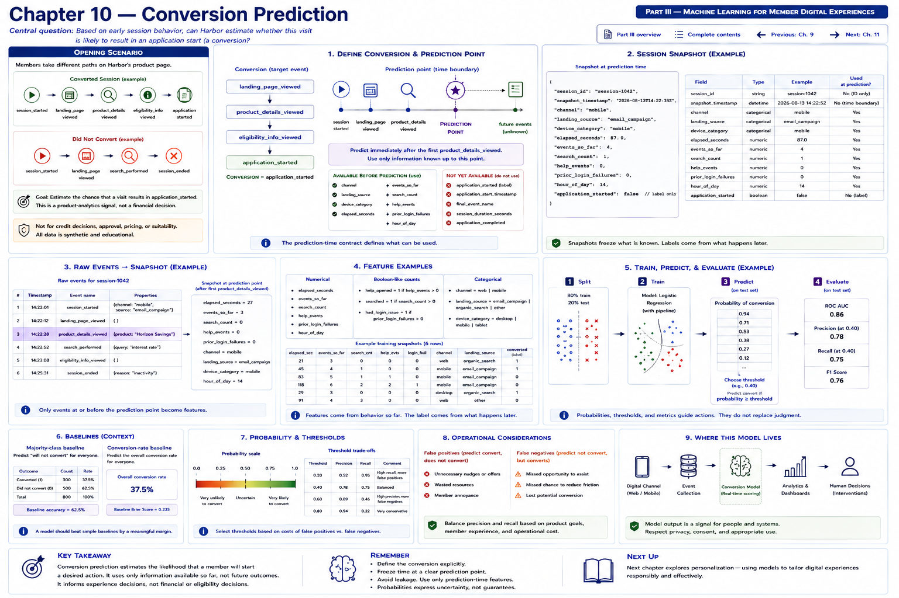

# Chapter 10 — Conversion Prediction



Harbor Federal Credit Union has redesigned the product-information page for its
fictional **Harbor Horizon Savings** product. One visit follows this path:

```text
session_started → landing_page_viewed → product_details_viewed
                → eligibility_info_viewed → application_started
```

Another ends differently:

```text
session_started → landing_page_viewed → product_details_viewed
                → search_performed → session_ended
```

The Digital Banking team asks:

> Based on what has happened early in the session, can Harbor estimate whether
> this visit is likely to result in an application start?

That is a **product-analytics signal**, not an advertising score or financial
decision. It must not determine qualification, approval, pricing, interest rate,
credit decisions, or account eligibility.

## Learning objectives

By the end of this chapter, you will be able to:

1. define a conversion explicitly and separate it from a financial outcome;
2. define and enforce a prediction point;
3. construct leakage-safe session snapshots from events;
4. distinguish conversion prediction from abandonment prediction;
5. build numerical, boolean-like count, and categorical features;
6. train a binary classifier and inspect its probabilities;
7. calculate conversion-rate and majority-class baselines;
8. reason about imbalance, false positives, and false negatives;
9. recognize temporal leakage; and
10. treat predictions as experience signals, never judgments of member worth.

## Define the conversion before modeling

> **A conversion is an explicitly defined digital action that Harbor wants to
> measure.**

For this exercise:

```text
landing_page_viewed
       │
       ▼
product_details_viewed
       │
       ▼
eligibility_info_viewed
       │
       ▼
application_started

conversion = application_started
```

The target answers only: **Did the member start the digital application?** It is
not `application_approved`. Approval is a later eligibility or financial decision
and is inappropriate for this experience model. The same boundary excludes
application completion, funding, and product suitability.

## Conversion versus abandonment

Chapter 9 began after a member had started a transfer. Chapter 10 begins earlier:

```text
ABANDONMENT MODEL                 CONVERSION MODEL

journey already started          digital session underway
        │                                │
        ▼                                ▼
Will it finish?                  Will a defined desired action begin?

Chapter 9: transfer_started      Chapter 10: product page viewed
→ will transfer complete?        → will application start?
```

Both are binary supervised questions and both require time-aware snapshots. Their
populations, targets, and operational meanings are different.

## Freeze time at the prediction point

Harbor predicts immediately after the **first** `product_details_viewed` event:

```text
session_started
      │
landing_page_viewed
      │
product_details_viewed
      │
      ▼
PREDICTION POINT
      │
      ▼
future events
      ├── application_started
      └── session_ended
```

The implementation sorts each session, finds that first event, and freezes the
prefix. The prediction point is part of the model contract, not merely a feature.

```text
FEATURE WINDOW
session start -------- product_details_viewed

LABEL WINDOW
product_details_viewed -------- session end
```

Valid values are known in the feature window:

```text
channel                         landing_source
device_category                 elapsed_seconds_at_prediction
events_before_prediction        searches_before_prediction
help_opened_before_prediction   prior_login_failures_in_session
hour_of_day
```

Values such as `application_started`, `application_start_timestamp`,
`final_event_name`, `session_duration_seconds`, `application_form_step_count`, and
`application_completed` leak the future when they occur after the snapshot. The
historical `application_started` outcome may construct the training label, but it
must never enter `X`.

## A session snapshot

The frozen dataclass makes the time boundary inspectable:

```python
@dataclass(frozen=True)
class ConversionSnapshot:
    session_id: str
    snapshot_timestamp: datetime
    channel: str
    landing_source: str
    device_category: str
    elapsed_seconds: float
    events_so_far: int
    search_count: int
    help_events: int
    prior_login_failures: int
    hour_of_day: int
    application_started: bool
```

`application_started` is the historical target only. `build_conversion_features`
selects its columns from `CONVERSION_FEATURES`, which deliberately omits both the
target and identifiers. The builder counts searches, help events, and login
failures only through the prediction event. Later events can change the label but
cannot change those counts.

The fixture uses educational landing sources—`direct`, `search`,
`email_campaign`, and `internal_navigation`. These do not claim real campaign
performance. Coarse devices are `desktop`, `tablet`, and `phone`; form factor can
describe a different UI without using a fingerprint or unique device identifier.

## The deterministic synthetic dataset

Chapter 10 extends the same Chapter 8 behavioral event universe with 500 eligible
product-detail sessions. The generator uses seed `808`, overlapping relationships,
and random noise. Lower friction, source, channel, device, help, and elapsed-time
patterns modestly affect a synthetic probability, but no category determines an
outcome. `email_campaign` does not always convert, and `phone` does not never
convert. These are fictional teaching relationships, not facts about members.

The generated fixture produces:

```text
Eligible sessions:             500
Application starts:            127
No application start:          373
Baseline conversion rate:      25.4%
Naive majority-class accuracy: 74.6%
```

The conversion rate is simply:

```text
converted sessions / eligible sessions = 127 / 500 = 25.4%
```

Because non-conversion is the majority class, an always-`no conversion` classifier
gets 373/500, or **74.6% accuracy**, without learning anything. This benchmark is
essential: respectable-looking accuracy can describe a weak model when classes
are imbalanced.

## Feature matrix and pipeline

The numerical columns are:

```python
("elapsed_seconds", "events_so_far", "search_count", "help_events",
 "prior_login_failures", "hour_of_day")
```

The categorical columns are:

```python
("channel", "landing_source", "device_category")
```

Counts represent boolean context naturally when they are zero or one while also
supporting repeated events. The scikit-learn pipeline contains a
`ColumnTransformer`: `StandardScaler` puts numerical columns on comparable scales,
and `OneHotEncoder(handle_unknown="ignore")` creates indicator columns for each
known category without pretending categories have numeric order. Ignoring an
unknown category prevents prediction from crashing; it does not validate that new
category's product meaning.

```python
Pipeline([
    ("preprocessor", ColumnTransformer([
        ("numeric", StandardScaler(), numeric_columns),
        ("categorical", OneHotEncoder(handle_unknown="ignore"),
         categorical_columns),
    ])),
    ("classifier", LogisticRegression(random_state=42, max_iter=1_000)),
])
```

The pipeline learns preprocessing only from training data when `.fit()` is called,
then applies the same learned transformation during `.predict()` and
`.predict_proba()`. The split is stratified, fixed at random state 42, and therefore
repeatable.

## Run the executable laboratory

From the repository root:

```bash
python examples/chapter_10_conversion_prediction.py
```

The committed data currently yields 375 training and 125 test observations. On
that test set the model reports:

```text
Model accuracy: 0.736

                 predicted
               no       yes
actual no       92         1
actual yes      32         0

False positives: 1
False negatives: 32
```

This result is instructive rather than impressive: **73.6% is below the full-data
majority baseline of 74.6%**. The fitted 0.50 decision rule rarely predicts the
minority class. Harbor should not celebrate raw accuracy or deploy this model. It
should revisit features, threshold policy, evaluation measures, and the intended
use. A teaching model is allowed to expose this analytical reality rather than
manufacture excellent performance.

In the matrix, a false positive predicts an application start but the session
ends without one. A false negative predicts no start but an application starts.
We deliberately stop short of a deeper precision/recall treatment.

## Probabilities and thresholds

The executable constructs three fictional states:

```text
Smooth product exploration
web, internal_navigation, desktop, 45 seconds, 3 events,
0 searches, 0 help events, 0 prior login failures
→ fitted probability 0.298; class at 0.50 = no

Friction-heavy session
mobile, search, phone, 180 seconds, 7 events,
3 searches, 2 help events, 1 prior login failure
→ fitted probability 0.041; class at 0.50 = no

Ambiguous session
web, direct, tablet, 90 seconds, 5 events,
1 search, 0 help events, 0 prior login failures
→ fitted probability 0.227; class at 0.50 = no
```

These values come from the fitted pipeline's positive-class `predict_proba` output,
not hand-written rules. For the ambiguous session the laboratory reuses **the same
0.227 probability**:

```text
threshold 0.30 → no
threshold 0.50 → no
threshold 0.70 → no
```

> The model probability stays the same; Harbor's classification policy changes.

A different fitted probability could cross one or more thresholds. The crucial
engineering property is that evaluating a threshold does not refit or rescore the
model.

## Errors matter according to use

A false positive means:

```text
MODEL:  predicts likely application start
ACTUAL: session ends without application start
```

It may have little consequence in aggregate analytics. If it triggers intrusive UI,
it can cause unnecessary prompts, distraction, and a degraded experience.

A false negative means:

```text
MODEL:  predicts no likely conversion
ACTUAL: application starts
```

Harbor may underestimate a successful journey. The consequences come entirely
from what the system does with the prediction. Prediction and intervention need
separate owners, contracts, logs, accessibility review, and evaluation.

## Architecture and low-risk uses

```text
                 HARBOR DIGITAL EXPERIENCE

Member → Web / Mobile → behavior events → session snapshot builder
                                      → conversion model
                                      → conversion probability
                                           ├── aggregate analytics
                                           ├── UX diagnostics
                                           └── optional low-risk assistance
```

This chapter does not implement real-time application integration. Appropriate
directions include aggregate product analytics, journey diagnostics, UX
experimentation, identifying friction patterns, measuring redesigns, and optional
contextual help. Inappropriate uses include financial eligibility, loan approval,
pricing, service denial, and access restriction.

The laboratory also reports actual rates by channel:

```text
mobile: 238 sessions, 23.1% actual conversion
web:    262 sessions, 27.5% actual conversion
```

The same technique can compare average predicted probabilities with average actual
rates by channel, landing source, or device category. Such group summaries are
diagnostic associations. “Mobile is lower in this fictional dataset” does **not**
prove “mobile causes lower conversion.” Selection, UI details, context, and omitted
variables can all differ.

```text
PREDICTIVE MODEL                 EXPERIMENT
What tends to happen?            What changes when we alter the experience?
```

If Harbor wants to know whether a redesign *causes* improvement, an appropriately
reviewed A/B experiment or another causal design answers that question better than
model associations.

## Prediction is not member value

This boundary is non-negotiable. A low predicted conversion probability does
**not** mean a low-value member, bad prospect, financially undesirable person,
ineligible applicant, or someone unworthy of support. It means only:

> Under this synthetic model, this early session state resembles historical
> sessions that were less likely to result in the defined digital event.

Harbor uses privacy-minimized behavioral and experience context. The model excludes
names, account numbers, balances, SSNs, income, credit scores, age, race, ethnicity,
religion, precise location, protected-class information, and raw identity data.
Coarse device context is enough for the educational UI question.

```text
PREDICT DIGITAL BEHAVIOR
WITHOUT TURNING THE MODEL INTO
A MEMBER PROFILING SYSTEM
```

Do not add personal financial fields merely to improve synthetic accuracy.

## Conversion optimization is not “maximize at any cost”

Higher conversion is not automatically better if obtained through confusing
defaults, manipulative prompts, hidden opt-outs, excessive urgency, or friction for
non-converting paths. Harbor's objective is a transparent, useful member experience
and legitimate self-service outcomes. Product health requires accessibility,
clarity, choice, complaints, and task success—not one metric in isolation.

## Testing the time boundary

The automated suite covers eligible-session detection, the first prediction event,
snapshot values, valid schemas, baselines, deterministic splitting, preprocessing,
fitting, probabilities, threshold validation, matrix shape, and malformed sessions.
Its strongest leakage test creates two sessions whose histories are identical
through `product_details_viewed`. One later starts an application and one does not.
Their feature arrays must be identical; only targets may differ.

That is the pattern to reuse in production event-pipeline tests: mutate the label
window and prove the feature window remains unchanged.

## Exercises

### 1 — Define the conversion

Compare `application_started`, `application_approved`, `loan_funded`, and
`product_details_viewed`. Which is most appropriate for this digital-experience
model, and why are later financial outcomes outside its contract?

### 2 — Feature or leakage?

Classify each value at this chapter's prediction point: `device_category`,
`landing_source`, `elapsed_seconds_at_prediction`, `application_started`,
`session_duration_seconds`, `searches_before_prediction`, and
`application_completed`. State the time evidence for every answer.

### 3 — Baseline

There are 100 sessions: 30 conversions and 70 non-conversions. What accuracy does
an always-no-conversion classifier achieve? Why must a real model be compared with
it?

### 4 — Prediction versus causation

Suppose mobile sessions have lower predicted conversion. Give at least three
reasons Harbor cannot conclude that mobile itself causes lower conversion. What
experiment could address a specific UI hypothesis?

### 5 — Member value

Why must a low conversion score never be treated as a judgment about the member?
Describe a code review or governance control that preserves the boundary.

### Coding exercise — product page revisits

Add the prediction-time feature `product_page_revisits`, counting product-details
views before the defined snapshot. Then:

1. update snapshot construction;
2. update preprocessing;
3. retrain with the same deterministic split policy;
4. compare evaluation with the previous feature set;
5. inspect the fitted relationship;
6. explain whether the feature appears useful; and
7. explicitly avoid a causal conclusion.

First decide precisely whether the prediction point remains the first details view
(making revisits necessarily zero) or moves to a later defined view. Document that
contract before coding; a feature with no possible variation cannot help.

## Key takeaways

1. A conversion must be explicitly defined.
2. Digital conversion is not financial approval or eligibility.
3. The prediction point determines legitimate features.
4. Historical future events can create labels but cannot leak into features.
5. Conversion rate provides an important baseline.
6. Compare a model with a naive majority-class predictor.
7. Conversion probabilities describe model behavior, not member worth.
8. Predictive associations do not prove causation.
9. UX experiments answer different questions from predictive models.
10. Conversion optimization should support useful, transparent experiences.

## What comes next

Chapter 11 — **Member Segmentation** changes from supervised questions:

```text
Chapter 9:  Will this journey be abandoned?
Chapter 10: Will this session convert?
```

to an unsupervised question:

> Are there recurring patterns of digital behavior even if Harbor does not define
> the groups in advance?

```text
SESSION SUMMARIES → behavioral features → CLUSTERING
                                      → groups with similar behavior
```

Possible fictional dimensions include session duration, account views, search
frequency, transfer activity, statement activity, help usage, and mobile/web mix.
Clusters are behavioral patterns—not member identities or value judgments.
Continue with [Chapter 11 — Member Segmentation](chapter-11-member-segmentation.md).

[Previous: Chapter 9 — Predicting Digital Journey Abandonment](chapter-09-predicting-digital-journey-abandonment.md) · [Next: Chapter 11 — Member Segmentation](chapter-11-member-segmentation.md) · [Back to Part III](README.md) · [Back to complete contents](../../CONTENTS.md)
