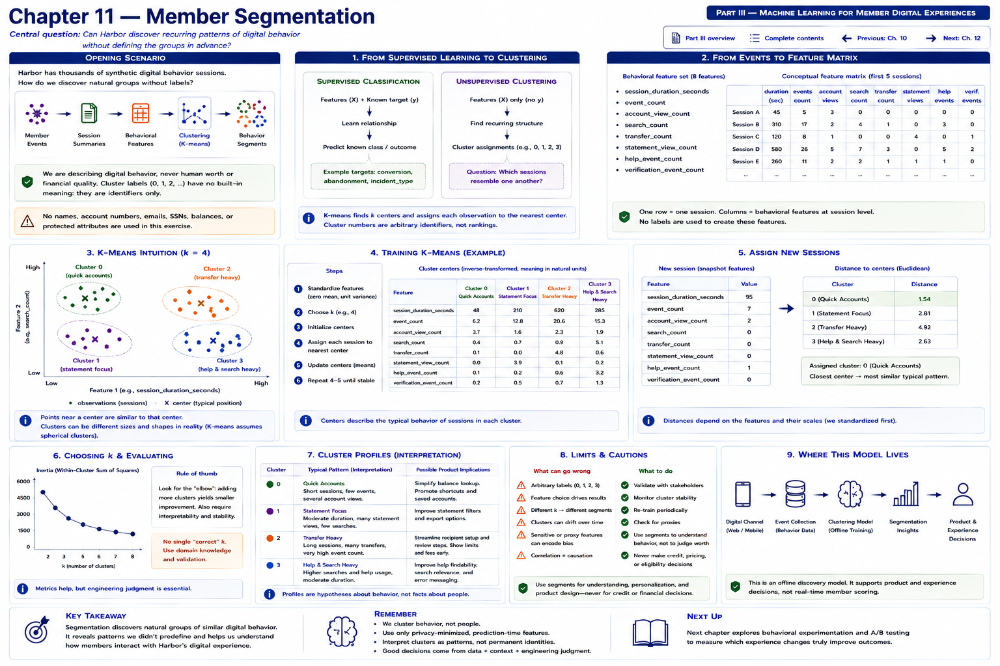

# Chapter 11 — Member Segmentation



> **Central question:** Can Harbor discover recurring patterns of digital behavior
> without defining the groups in advance?

[Previous: Chapter 10 — Conversion Prediction](chapter-10-conversion-prediction.md) ·
[Back to Part III](README.md) · [Complete contents](../../CONTENTS.md)

Harbor Federal Credit Union's Digital Banking team now has thousands of entirely
fictional behavioral sessions. Some are quick account checks; others contain
transfer activity, search and help usage, or statement viewing. The team could
invent categories such as “mobile users,” “transfer users,” and “search users.”
That would impose assumptions before looking at the data.

Instead Harbor asks:

> If we represent each session using a few behavioral measurements, do recurring
> groups emerge naturally?

```text
MEMBER EVENTS
      │
      ▼
SESSION SUMMARIES
      │
      ▼
BEHAVIORAL FEATURES
      │
      ▼
CLUSTERING
      │
      ▼
GROUPS OF SIMILAR SESSIONS
```

This chapter describes synthetic **digital behavior**, never human worth or
financial quality. A result is a behavioral cluster, session pattern, digital
usage pattern, or interaction pattern—not a permanent identity.

## Learning objectives

By the end, you can explain clustering in engineering terms; distinguish it from
classification; explain why it has no target; construct session features; explain
scaling; train K-means; interpret and inverse-transform centers; assign new
sessions; compare `k` and inertia; recognize arbitrary cluster numbers and
feature dependence; avoid overinterpretation; and use clusters for exploratory
product analysis.

## From known outcomes to recurring structure

Chapters 9 and 10 used supervised classification:

```text
SUPERVISED LEARNING              CLASSIFICATION

features                         X + y
   +                               │
known target                       ▼
   ↓                            learn relationship
predict outcome                    │
                                   ▼
                                predict known class
```

Chapter 11 has no `conversion`, `abandonment`, or `incident_type` target:

```text
UNSUPERVISED CLUSTERING           CLUSTERING

features                          X
   ↓                              │
find recurring structure          ▼
                                find groups
                                   │
                                   ▼
                                cluster assignments
```

The question is **which digital sessions resemble one another?** There is an `X`
but no supervised `y`. Cluster labels `0`, `1`, `2`, and `3` are identifiers with
no built-in semantics: cluster 2 is not inherently better, worse, stronger, or
more important than cluster 0.

## From events to a feature matrix

The laboratory loads the Chapter 8–10 event fixture and reuses
`group_events_by_session`. It derives one row per session; it does not create an
unrelated member table. The fixture generator adds 400 varied Chapter 11 sessions
to the same behavioral universe. Its private generation tendencies—quick account
check, transfer focused, statement research, and help/search heavy—create
meaningful but overlapping variation. They are **not written as labels** and are
never given to K-means.

The privacy-minimized schema is:

```python
SEGMENTATION_FEATURES = (
    "session_duration_seconds",
    "event_count",
    "account_view_count",
    "search_count",
    "transfer_count",
    "statement_view_count",
    "help_event_count",
    "verification_event_count",
)
```

Conceptually:

```text
session    duration  events  accounts  search  transfers  statements  help
A            45        5       3         0        0          0         0
B           310       17       2         4        1          0         3
C           120        8       1         0        0          4         0
...

rows    → sessions
columns → behavioral features
target  → none
```

The code counts event vocabulary entries, including all `transfer_*` and
`verification_*` events, rather than copying outcome labels. It validates nonempty
sessions, matching pseudonymous IDs, one channel per session, finite values, and
nonnegative features. No name, account number, email, SSN, exact balance, income,
credit score, age, protected attribute, precise location, or eligibility field is
present. Even `session_id` is retained only to trace a row; it is excluded from X.

## K-means intuition

This chapter uses scikit-learn's `KMeans`:

> K-means looks for `k` centers in feature space and assigns observations to the
> nearest center.

```text
          ● ●
       ● ● ● ●
          A

                           ● ●
                        ● ● ●
                           B

      ● ●
   ● ● ●
      C
```

```text
cluster center ≈ typical position of observations in that cluster
```

The algorithm repeatedly updates assignments and centers. We do not need the full
optimization derivation to use it responsibly. “Nearest” means Euclidean distance
in the transformed feature space. Distances are **not probabilities**.

## Scaling is part of the model

Suppose one row contains:

```text
session_duration_seconds = 420
search_count = 3
```

Raw duration can dominate distance merely because it is measured in hundreds:

```text
BEFORE SCALING              AFTER STANDARDIZATION

duration       420          duration       comparable scale
search           3          search         comparable scale
help             1          help           comparable scale
```

`StandardScaler` centers each training feature and scales it by its standard
deviation. This does not make features equally important in every substantive
sense, but prevents their units alone from deciding distance.

```text
SESSION FEATURES
      │
      ▼
StandardScaler
      │
      ▼
KMeans
      │
      ▼
cluster assignment
```

The executable encodes that order in one pipeline. Prediction applies the fitted
scaler before the fitted K-means model, preventing training/serving mismatch.

## Choosing `k` and reading inertia

`k` is the requested number of clusters. K-means does not choose it automatically.
The laboratory compares `k = 2`, `3`, `4`, and `5`.

Inertia measures the sum of squared distances from observations to their assigned
centers. Lower inertia usually means tighter clusters, but:

```text
larger k → almost always lower inertia

k     inertia
2     8137.95
3     6243.33
4     4758.63
5     3850.25
```

These are deterministic results for the committed synthetic fixture. Selecting
the largest possible `k` would be meaningless: one center per observation drives
inertia toward zero without providing a useful summary. An “elbow” is a point
where added clusters provide diminishing improvement, but it is a visual heuristic,
not objective truth. We use `k = 4` for teaching clarity—not as a mathematically
definitive answer. Product usefulness, stability, inspectability, and domain review
also matter.

## Executable laboratory

Run from the repository root:

```bash
PYTHONPATH=src python examples/chapter_11_member_segmentation.py
```

It prints the institution and laboratory name, 1,290 behavioral sessions, the
feature list, `Target: none`, all four inertia values, summaries, centers, and new
session predictions. The implementation lives in
`src/harbor_ml/member_segmentation.py` and tests are in
`tests/test_member_segmentation.py`.

The fitted four-cluster solution currently summarizes:

| Cluster ID | Sessions | Mean duration | Events | Accounts | Search | Transfers | Statements | Help |
|---:|---:|---:|---:|---:|---:|---:|---:|---:|
| 0 | 622 | 103.82 | 5.98 | 0.22 | 0.57 | 0.07 | 0.07 | 0.20 |
| 1 | 153 | 137.75 | 9.63 | 3.01 | 0.16 | 0.00 | 2.24 | 0.00 |
| 2 | 396 | 122.12 | 8.71 | 0.25 | 0.42 | 2.80 | 0.00 | 0.31 |
| 3 | 119 | 228.52 | 9.81 | 0.19 | 3.30 | 0.04 | 0.00 | 1.93 |

An analyst might describe these as “short/light-activity sessions,”
“search/help-heavy sessions,” “transfer-focused sessions,” and
“statement/account-research sessions.” Those names are review aids:

```text
MODEL OUTPUT
cluster_id = 1

ANALYST INTERPRETATION
"This cluster tends to contain longer sessions with more search/help events."
```

They are not targets and are not model-produced truths. In particular, the model
did not discover “confused members”; that would infer an unsupported mental state.

## Centers in behavioral units

The K-means step learns centers after standardization. Its raw `cluster_centers_`
therefore contains standardized coordinates:

```text
MODEL CENTER
standardized values
       │
       ▼
scaler.inverse_transform(...)
       │
       ▼
behavioral units
```

The code extracts the fitted objects precisely:

```python
scaler = model.named_steps["scaler"]
kmeans = model.named_steps["kmeans"]
centers = scaler.inverse_transform(kmeans.cluster_centers_)
```

For example, the actual cluster 3 center is about 229 seconds, 9.81 events, 3.30
searches, and 1.93 help events. Cluster 1's center has about 3.01 account views and
2.24 statement views. Because a center is a mean position, counts may be fractional
and tiny inverse-transform artifacts can print as `-0.00`; neither means an actual
session had a fractional or negative event.

## Assigning new sessions

The laboratory creates fictional `BehavioralSession` values and calls
`pipeline.predict`; assignments are not hard-coded. With this fit, a transfer-heavy
example is assigned to cluster 2. The deliberately extreme quick-account example
is assigned by all eight scaled dimensions; its result need not match an analyst's
single-feature intuition. That tension is useful: inspect distances and centers
rather than forcing a preferred label.

```text
new row → fitted StandardScaler → distance to each fitted center → nearest cluster
```

A future fit with a different initialization might swap cluster 0 and cluster 2
while preserving essentially the same grouping. Fixed `random_state=42` and
`n_init=10` make this laboratory reproducible, not semantically ordered.

## Feature choice controls the result

```text
CLUSTERS ARE NOT DISCOVERED IN A VACUUM

selected features
       +
scaling
       +
algorithm
       +
chosen k
       +
dataset
       ↓
clustering result
```

Remove `statement_view_count`, and statement-focused behavior may cease to be a
recognizable group. Add duration with appropriate scaling, and time becomes another
similarity dimension. Add channel, change event definitions, sample a different
time window, or choose another algorithm, and the grouping can change. Clusters
are useful model constructions—not pre-existing natural kinds that software simply
reveals.

### Ablation experiment

Repeat the fit with all eight features and without `help_event_count`:

1. construct both X matrices from the same rows;
2. fit a fresh scaler and four-center model for each;
3. report inertia, center patterns, and cluster sizes;
4. inspect whether the search/help pattern merges or redistributes; and
5. document the changed question.

Do **not** compare supervised accuracy: no target exists. Raw inertia values across
different feature spaces are not directly decisive because dimensionality changed.
The ablation is exploratory; a lower number alone does not make one solution
objectively better.

## Exploration, not causation

```text
OBSERVATION
One cluster has more help events.

UNSUPPORTED CLAIM
Help usage causes long sessions.

UNSUPPORTED CLAIM
These members are confused.
```

Clustering describes similarity in selected variables. It neither establishes a
causal direction nor observes intentions or mental states. A useful product question
might be: **Are these workflows harder to navigate?** Research, accessibility
review, usability tests, and experiments must evaluate that hypothesis. Similarly,
short sessions with many account views motivate investigation of whether quick
account-check workflows are efficient; they do not prove efficiency.

## Clustering versus explicit rules

```text
RULE-BASED SEGMENT
if transfer_count > 3:
    "transfer session"

CLUSTERING
several behavioral dimensions
       │
       ▼
groups based on similarity
```

If Harbor already has a clear, reviewable business definition, the rule may be
simpler and more stable. Use clustering to explore multi-dimensional structure,
not merely because it sounds more sophisticated.

## Privacy, fairness, and appropriate boundaries

Behavioral clustering can become broad profiling if scope expands silently. This
laboratory permits:

```text
USE
session-level digital interaction patterns
```

It excludes:

```text
DO NOT USE
protected attributes       financial worth       credit risk
income                     demographics          precise identity
```

Harbor must not turn session clusters into hidden eligibility tiers, unequal service
access, pricing, approval, credit, or adverse-action inputs. Nor should it join them
to direct identity merely because that is technically possible. Establish purpose
limitation, retention limits, access control, data lineage, schema review, and human
review of proposed uses. Reassess whether even pseudonymous session data is needed.

Appropriate educational applications include UX research, navigation analysis,
instrumentation review, understanding common session patterns, and prioritizing
usability investigation. Aggregate reporting should use minimum group sizes and
avoid presenting descriptions as facts about people. Product teams should use
clusters to generate questions, then validate those questions with evidence.

## Exercises

### 1 — Supervised or unsupervised?

Classify these questions:

```text
Will this journey be abandoned?
Which incident category is occurring?
Which sessions naturally resemble one another?
Will this session start an application?
```

The first, second, and fourth are supervised when historical labels exist. The
third is unsupervised clustering.

### 2 — What is the target?

For this K-means problem, what is `y`?

> There is no supervised target `y`.

### 3 — Scaling

Given `session_duration_seconds = 600` and `help_count = 2`, explain why raw
Euclidean distance can overweight duration. Show what standardization changes—and
what it does not claim about substantive importance.

### 4 — Cluster interpretation

A cluster averages long duration, high search count, and high help count. Which is
supported?

A. These sessions have more search/help activity.  
B. These members are confused.  
C. Search activity causes long sessions.

Only A is directly supported.

### 5 — Cluster IDs

Does cluster 3 mean behavior is stronger or better than cluster 1? **No.** IDs are
arbitrary identifiers, not ranks.

### Coding exercise — dashboard views

Add `dashboard_view_count`:

1. derive it from the event stream;
2. add it to the feature matrix in a documented position;
3. retrain K-means;
4. compare inertia;
5. inspect inverse-transformed centers;
6. compare cluster sizes;
7. describe what changed; and
8. avoid claiming the new clustering is objectively better.

Also update validation and tests so malformed values cannot silently enter X.

## Key takeaways

1. Clustering is unsupervised learning; there is no known target label.
2. K-means groups observations by distance to learned centers.
3. Scaling matters because K-means is distance-based.
4. `k` must be chosen; no single objectively correct number is revealed.
5. Inertia describes compactness and tends to decrease as `k` grows.
6. Cluster IDs have no inherent meaning or order.
7. Analyst descriptions are interpretations, not model truths.
8. Results depend strongly on features, scaling, algorithm, `k`, and dataset.
9. Clustering describes association, not cause or mental state.
10. Behavioral clustering supports UX exploration—not human-value judgments or
    financial eligibility decisions.

## Part III conclusion

```text
PART III — MEMBER DIGITAL EXPERIENCES

Chapter 8
How do we represent member behavior?
        │
        ▼
Chapter 9
Will an in-progress journey be abandoned?
        │
        ▼
Chapter 10
Will an early digital session convert?
        │
        ▼
Chapter 11
What recurring behavioral patterns appear?
```

Part III used ML primarily to understand the **digital experience**: first event
representation, then two supervised prediction points, and finally unsupervised
structure. Each technique required a precise question, minimized schema, temporal
or feature contract, validation, and limits on interpretation.

## What comes next: Part IV — Machine Learning for Banking Operations

Chapter 12 — **Transaction Anomaly Detection** will ask:

> Given a stream of entirely fictional transaction-like operational records, can
> Harbor identify observations that differ substantially from established patterns?

Possible educational features include `amount_band`, `time_of_day`,
`transaction_type`, `channel`, `recent_transaction_count`, and
`distance_from_recent_pattern`. The focus will be anomaly-detection mechanics and
safe escalation—not automatically accusing a member of fraud. Continue to the
implemented Chapter 12 laboratory.

[Previous: Chapter 10 — Conversion Prediction](chapter-10-conversion-prediction.md) ·
[Back to Part III](README.md) ·
[Next: Chapter 12 — Transaction Anomaly Detection](../part-04-banking-operations/chapter-12-transaction-anomaly-detection.md) ·
[Complete contents](../../CONTENTS.md)
