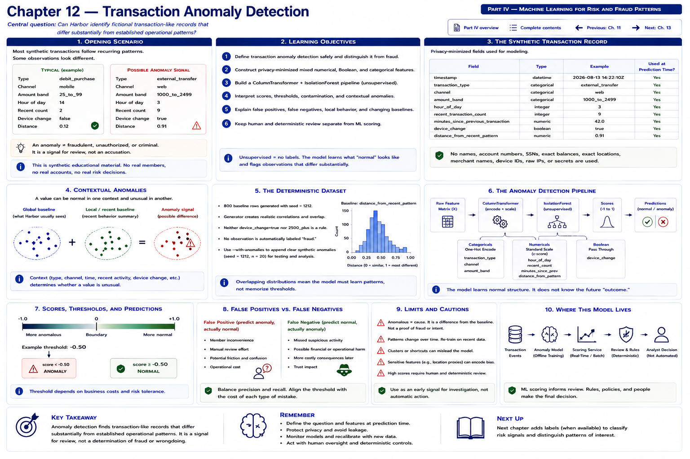

# Chapter 12 — Transaction Anomaly Detection



> **Central question:** Can Harbor identify fictional transaction-like records that
> differ substantially from established operational patterns?

[Previous: Chapter 11 — Member Segmentation](../part-03-member-digital-experiences/chapter-11-member-segmentation.md) ·
[Next: Chapter 13 — Classification and Risk Signals](chapter-13-classification-and-risk-signals.md) ·
[Back to Part IV](README.md) · [Complete contents](../../CONTENTS.md)

Harbor Federal Credit Union processes many fictional transaction-like events through
its digital systems. Most follow recurring operational patterns. Consider these two
privacy-minimized observations:

```text
transaction_type = debit_purchase       transaction_type = external_transfer
channel = mobile                         channel = web
amount_band = 25_to_99                   amount_band = 1000_to_2499
hour_of_day = 14                         hour_of_day = 3
recent_transaction_count = 2             recent_transaction_count = 9
device_change = false                     device_change = true
distance_from_recent_pattern = 0.12       distance_from_recent_pattern = 0.91
```

The second may differ more from the synthetic baseline. It does not explain why.
Travel, a one-time purchase, a legitimate transfer, a new device, unusual timing,
or a changed routine are all possible benign contexts. The engineering question is
only: **does this observation look substantially different from the training
baseline?**

```text
UNUSUAL
   ≠
FRAUDULENT
   ≠
UNAUTHORIZED
   ≠
CRIMINAL
```

An anomaly is a signal for controlled review, observability, or additional
deterministic checks. It is not an accusation.

## Learning objectives

By the end of this chapter, you can:

1. define transaction anomaly detection safely and distinguish it from fraud determination;
2. construct privacy-minimized mixed numerical, Boolean, and categorical features;
3. build a `ColumnTransformer` and unsupervised `IsolationForest` pipeline;
4. interpret scores, thresholds, contamination, and contextual anomalies;
5. explain false positives, false negatives, local behavior, and changing baselines; and
6. keep human and deterministic review separate from ML scoring.

## A deliberately simplified record

`TransactionObservation` contains only:

```text
timestamp                       transaction_type
channel                         amount_band
hour_of_day                     recent_transaction_count
minutes_since_previous_transaction
device_change                   distance_from_recent_pattern
```

Generic types are `debit_purchase`, `bill_payment`, `internal_transfer`,
`external_transfer`, `atm_withdrawal`, and `deposit`. Channels are `web`, `mobile`,
`atm`, and `branch_assisted`. These are teaching categories, not a reproduction of
a real core-banking schema.

Amounts are coarse categories: `under_25`, `25_to_99`, `100_to_499`,
`500_to_999`, `1000_to_2499`, and `2500_plus`. A real system may use exact amounts
inside appropriately controlled systems, but exact values are unnecessary to teach
this ML pattern. The repository contains no account or card number, member name,
SSN, exact location or balance, merchant name, device identifier, raw IP address,
or authentication secret.

`distance_from_recent_pattern` is a precomputed fictional value representing local
context. It is not produced by member surveillance, nor do we build such a system.
It exists solely to show how recent context can complement the global baseline.

## Contextual anomalies

A value need not be globally extreme to be unusual:

```text
VALUE
   +
CONTEXT
   =
POSSIBLE ANOMALY SIGNAL
```

For example, `500_to_999` can be ordinary for a synthetic bill payment but less
common in a different combination. `hour_of_day = 3` is not inherently suspicious.
Timing becomes informative only in relation to transaction type, recent activity,
device change, amount band, and other learned patterns. Likewise, a large transfer
in otherwise common context need not cross the fitted cutoff.

Two baselines are useful concepts:

```text
GLOBAL BASELINE                         LOCAL / RECENT BASELINE
What do Harbor records usually          How different is this observation
look like?                              from recent behavior?
```

The pipeline learns global combinations from the fixture. The synthetic distance
feature supplies a deliberately simplified summary of local context. It does not
identify a person or explain a cause.

## The deterministic dataset

Run `python scripts/generate_transaction_observations.py` to reproduce 800 baseline
rows with seed `1212`. The generator adds overlapping noise and correlations:
purchase hours are broad; transfer amount bands differ; recent counts are usually
modest; device changes are uncommon but present; and large values remain possible.
Neither `device_change = true` nor `2500_plus` is a deterministic anomaly rule.
These tendencies are educational—not claims of real-world realism.

`data/harbor_transaction_observations.csv` has no target, anomaly label, or scenario
name. The five manually written scenarios live separately in
`data/harbor_transaction_scenarios.csv`. The executable fits on the former only:

```text
BASELINE TRANSACTIONS
        │
        ▼
feature representation
        │
        ▼
Isolation Forest
        │
        ▼
learned notion of common/rare combinations
```

> The detector only knows the baseline it was given.

An incomplete, stale, biased, or unrepresentative baseline produces results that
reflect those limitations. The scenarios are evaluation probes, not training rows.

## Mixed feature preprocessing

The model cannot consume strings directly. Chapter 12 extends the preprocessing
ideas from Chapters 7, 9, and 10:

| Kind | Features | Transformation |
|---|---|---|
| categorical | `transaction_type`, `channel`, `amount_band` | one-hot encoding |
| numerical | `hour_of_day`, `recent_transaction_count`, `minutes_since_previous_transaction`, `distance_from_recent_pattern` | standard scaling |
| Boolean | `device_change` | convert to 0/1 |

```text
categorical ──► OneHotEncoder ─┐
numeric ──────► StandardScaler ├─► transformed numerical matrix ─► IsolationForest
Boolean ──────► 0/1 ───────────┘
```

The installed dependency contract is scikit-learn `>=1.4,<2`, whose
`OneHotEncoder` supports `sparse_output`. The implementation explicitly sets
`sparse_output=False` for a predictable dense matrix and
`handle_unknown="ignore"` so an unseen category does not crash transformation.
Successful transformation does **not** mean the detector understands an unseen
category well; it merely means its unknown one-hot positions remain zero.

The complete pipeline is:

```python
Pipeline([
    ("preprocessor", build_transaction_preprocessor()),
    ("detector", IsolationForest(contamination=0.04, random_state=1212)),
])
```

Using one fitted pipeline prevents training/inference preprocessing mismatch.

## Why Isolation Forest?

Isolation Forest recursively partitions transformed observations. Combinations
that become isolated in fewer partitions tend to be less like the fitted baseline.
It does not learn a fraud target because no such target exists here.

| Chapter 4 | Chapter 12 |
|---|---|
| application telemetry | transaction-like behavior |
| system incident signal | transaction anomaly signal |
| numerical telemetry | mixed categorical/numerical features |
| Isolation Forest | Isolation Forest |
| investigate system health | controlled transaction review signal |

> Same ML pattern, different engineering context.

## Score semantics and threshold

scikit-learn's `decision_function` is positive on the normal side of its learned
cutoff and negative on the anomaly side. Harbor exposes its **negation**:

```text
raw_score = -pipeline.decision_function(observation)
```

Therefore, **higher means more unusual**, and zero is the fitted decision boundary.
A positive score is classified as anomaly by the fitted detector; a negative score
is classified as normal. It is an uncalibrated relative unusualness score—not a
fraud probability, unauthorized-transaction probability, confidence, or proof.

```text
continuous score
      │
      ▼
threshold
      │
      ▼
normal / anomaly
```

With this higher-is-more-unusual convention, lowering a chosen threshold flags more
observations; raising it flags fewer. Production threshold selection would weigh
review capacity and error costs. Here `contamination=0.04` helps Isolation Forest
establish a cutoff in the synthetic teaching dataset. It is not Harbor's “fraud
rate,” an estimate of wrongdoing, or a claim about real transactions.

## Executable laboratory

Run:

```bash
python examples/chapter_12_transaction_anomaly_detection.py
```

The committed baseline currently produces these fitted values:

| Scenario | Anomaly score | Classification | Lesson |
|---|---:|---|---|
| `routine_mobile_purchase` | -0.1357 | normal | common combination |
| `large_normal_transfer` | -0.0198 | normal | large alone is not automatically anomalous |
| `unusual_combination` | 0.0921 | anomaly | several unusual contextual values combine |
| `new_device_routine_behavior` | -0.0735 | normal | device change alone is insufficient |
| `high_recent_activity` | -0.0648 | normal | high activity needs context too |

These values come from the fitted detector rather than hard-coded output. They are
stable for the committed dependency range, fixture, parameters, and seed, but are
not universal thresholds. The unusual scenario combines an external transfer,
`2500_plus`, hour 3, count 8, a four-minute interval, device change, and distance
0.94. Its flag says only that the combination differs from baseline.

## False positives and false negatives

```text
legitimate routine/benign behavior       truly unusual behavior
             ↓                                      ↓
     flagged as anomalous                       not flagged
       FALSE POSITIVE                         FALSE NEGATIVE
```

A false positive creates unnecessary review workload and, if acted on carelessly,
poor member experience and reduced operational trust. A false negative misses an
investigative signal. Neither concept turns this exercise into a fraud guarantee.
Evaluation needs manually reasoned scenarios and operational outcomes separate from
the unsupervised training process.

## Anomaly is not wrongdoing

This is the most important model contract:

```text
MODEL
"This observation differs from the learned baseline."

NOT
"This member committed fraud."
```

Real operational controls may include deterministic transaction controls,
authentication systems, vendor risk systems, specialized fraud tooling, human
review, and regulatory processes. This textbook detector replaces none of them. It
must not drive credit approval, eligibility, pricing, law-enforcement conclusions,
or punitive decisions.

Never design this shortcut:

```text
ML anomaly ──► freeze account / deny transaction
```

Prefer a deliberately separated flow:

```text
ML anomaly
    ├── add observability
    ├── produce a review signal
    ├── enrich an operational dashboard
    └── support controlled investigation
```

Humans and deterministic systems need their own evidence, authorization, audit
trail, and safeguards. The model score is only one input.

## Behavior shift and concept drift

Travel, a new job, moving, a major purchase, a new device, or a recurring new
payment can legitimately change behavior. An older baseline may initially call the
new routine unusual; after carefully governed retraining, it may become ordinary.

```text
ANOMALY means different from baseline
        not wrong

past behavior ─► model baseline
changed behavior ─► old baseline becomes less representative
```

This is **concept drift**. Chapter 25 will discuss production model monitoring;
this chapter does not implement drift tracking or per-member surveillance.

## Exercises

### 1 — Anomaly or fraud?

Given `model says: anomaly`, what can Harbor conclude? The supported answer is:
“The observation differs from the learned baseline.” Harbor cannot conclude that
fraud occurred.

### 2 — Context

Compare a `2500_plus` transfer in (A) otherwise ordinary behavior and (B) unusual
timing, high recent count, new device, and large recent-pattern distance. Explain
why B may score higher without treating any individual value as wrongdoing.

### 3 — Feature type

Classify `transaction_type` and `amount_band` as categorical, `hour_of_day` and
`recent_transaction_count` as numerical, and `device_change` as Boolean. Explain
the transformation each requires.

### 4 — False positive

Describe review workload, member-experience, and trust harms from treating every
anomaly as wrongdoing. Propose a non-punitive review boundary.

### 5 — Baseline drift

What happens when legitimate behavior changes permanently? Discuss when an old
baseline stops representing current operations and what must be validated before
retraining.

### Coding exercise — `late_night_bill_payment`

Create a `TransactionObservation` with `bill_payment`, a moderate amount band, a
late hour, low recent count, no device change, and moderate recent-pattern distance.
Score it; print its classification; compare it with `unusual_combination`; explain
why late timing alone is not wrongdoing; and state explicitly that the anomaly
score is not a fraud probability.

## Key takeaways

1. Transaction anomaly detection is unsupervised pattern recognition.
2. Unusual does not mean fraudulent, unauthorized, or criminal.
3. Context matters more than isolated values.
4. Mixed categorical and numerical data requires preprocessing.
5. The training baseline defines what the detector considers common.
6. Isolation Forest produces anomaly-related scores, not fraud probabilities.
7. False positives can harm member experience and operational trust.
8. Legitimate behavior shifts can initially look unusual.
9. ML signals support controlled investigation, not punitive automation.
10. The anomaly pattern transfers from application telemetry to transaction-like data.

## What comes next: Chapter 13 — Classification and Risk Signals

This detector asks: **does this transaction-like observation look unusual?** Chapter
13 will ask a different, supervised question: **given labeled operational examples,
can Harbor predict a defined review category or operational risk signal?** A safe
fictional target could be `manual_review_required`, based on synthetic historical
review outcomes:

```text
transaction features ─► supervised classifier ─► review probability
                     ─► controlled operational review
```

It is not a credit-risk, loan-approval, or member-worth model. Continue to the
implemented supervised-routing chapter.

[Previous: Chapter 11 — Member Segmentation](../part-03-member-digital-experiences/chapter-11-member-segmentation.md) ·
[Next: Chapter 13 — Classification and Risk Signals](chapter-13-classification-and-risk-signals.md) ·
[Back to Part IV](README.md) · [Complete contents](../../CONTENTS.md)
