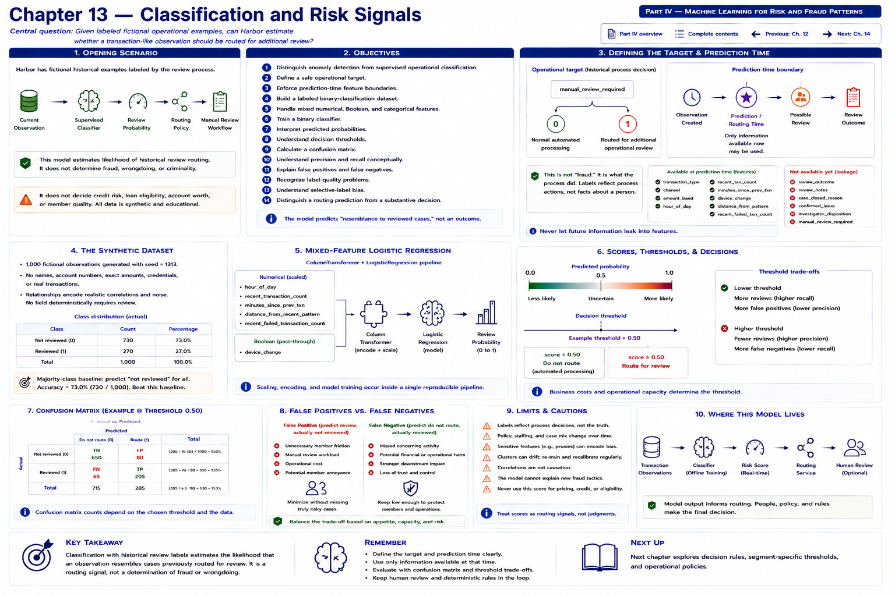

# Chapter 13 — Classification and Risk Signals



Chapter 12 asked whether a transaction-like observation differed from a learned baseline. Now imagine **Harbor Federal Credit Union** also has fictional historical review records: some observations were routed to additional operational review, while others followed normal automated processing.

> **Central question:** Given labeled fictional operational examples, can Harbor estimate whether a transaction-like observation should be routed for additional manual review?

```text
CURRENT OBSERVATION
       │
       ▼
SUPERVISED CLASSIFIER
       │
       ▼
manual-review probability
       │
       ▼
routing policy
       │
       ▼
controlled review workflow
```

The classifier supplies a controlled routing signal. It does **not** determine fraud, wrongdoing, criminality, unauthorized activity, credit risk, loan eligibility, account worth, or member quality. Every record and relationship here is synthetic.

## Learning objectives

By the end of this chapter, you should be able to:

1. distinguish anomaly detection from supervised operational classification;
2. define a safe operational target;
3. distinguish features from review outcomes;
4. build a labeled binary-classification dataset;
5. handle mixed numerical, Boolean, and categorical features;
6. train a binary classifier;
7. interpret predicted probabilities;
8. understand decision thresholds;
9. calculate a confusion matrix;
10. understand precision and recall conceptually;
11. explain the different operational costs of false positives and false negatives;
12. recognize label-quality problems;
13. understand selective-label bias; and
14. distinguish a routing prediction from a substantive decision.

## Chapter 12 versus Chapter 13

```text
CHAPTER 12

No target label
     │
     ▼
Anomaly detector
     │
     ▼
"Does this look unusual?"
```

```text
CHAPTER 13

Historical review labels
     │
     ▼
Supervised classifier
     │
     ▼
"Does this resemble cases historically sent for review?"
```

These are different questions. An unusual observation need not resemble historically reviewed cases. Conversely, deterministic policy can route a common-looking pattern. Anomaly score and review probability can disagree.

## Define the target carefully

The target is a historical process field:

```text
manual_review_required

0 = normal automated processing
1 = routed for additional operational review
```

It is emphatically **not** `1 = fraud` or `1 = suspicious person`. A one records what the fictional process did, not a finding about an observation or person. “Risk signal” here means operational routing likelihood only.

### Prediction time is a data boundary

Define the routing timestamp before selecting features:

```text
OBSERVATION CREATED
       │
       ▼
prediction / routing time
       │
       ▼
possible manual review
       │
       ▼
review outcome
```

Only information available at or before routing may enter `X`:

```text
transaction_type
channel
amount_band
hour_of_day
recent_transaction_count
minutes_since_previous_transaction
device_change
distance_from_recent_pattern
recent_failed_transaction_count
```

Later information cannot flow backward. These fields are leakage:

```text
review_outcome
review_notes
case_closed_reason
confirmed_issue
manual_review_required
investigator_disposition
```

The target belongs in `y`, not `X`; post-review fields belong in neither routing-time feature set. This temporal contract matters more than a high test score.

## The deterministic synthetic dataset

`data/harbor_review_routing.csv` contains 1,000 deterministic fictional rows. It was generated with seed 1313 and includes timestamps, coarse attributes, context signals, and the routing label. It contains no identity, exact amount, account number, credential, or real transaction. Reproduce the committed fixture with:

```bash
python scripts/generate_review_routing.py
```

The generator combines higher recent-pattern distance, transaction count, recent failures, several interactions, and random variation. No isolated device change or `2500_plus` band always causes review. These are educational relationships—not estimates of a real institution, population, policy, or rate.

The executable laboratory calculates the actual distribution:

```text
not reviewed: 730
reviewed: 270
```

The reviewed class is 27%. A classifier that always predicts “no review” achieves 730 / 1,000 = **73.0% accuracy** without identifying one reviewed example. Always compare accuracy with this majority-class baseline; accuracy alone can conceal failure on the less common class.

## Mixed-feature logistic regression

The implementation groups routing-time inputs as follows:

```text
Numerical
hour_of_day
recent_transaction_count
minutes_since_previous_transaction
distance_from_recent_pattern
recent_failed_transaction_count

Boolean
device_change

Categorical
transaction_type
channel
amount_band
```

The scikit-learn `Pipeline` standardizes numbers, passes the Boolean as 0/1, one-hot encodes categories with `handle_unknown="ignore"`, and fits logistic regression. This keeps training and prediction preprocessing together. Unknown categories can be encoded, but that is not evidence that the model understands a new product.

```python
rows = load_review_dataset("data/harbor_review_routing.csv")
X = build_review_features(rows)
y = build_review_targets(rows)
split = split_review_dataset(X, y)
model = train_review_model(build_review_pipeline(), split.X_train, split.y_train)
probabilities = predict_review_probabilities(model, split.X_test)
```

The seeded, stratified split is repeatable, retains both classes, and holds test data out of fitting.

## Probability, policy, and calibration

If the model returns:

```text
manual_review_probability = 0.72
```

this means: **given this synthetic fitted model, the feature pattern resembles historically reviewed examples.** It does not mean `72% probability of fraud` or `72% probability of criminal activity`.

Logistic regression emits values between zero and one, but outputs may not be perfectly calibrated. A value like 0.70 should not automatically be assumed to mean exactly 70 out of 100 comparable real-world observations require review. Population change, policy change, calibration, and dataset construction matter.

A threshold converts an output into a proposed routing signal:

```python
predicted_review = probability >= threshold
```

The threshold is a policy parameter, not a truth boundary.

## Confusion matrix

```text
                         predicted

                      no review   review

actual no review          TN        FP
actual review             FN        TP
```

- **TN:** model and historical label both say no review.
- **FP:** model routes; historical label says no review.
- **FN:** model does not route; historical label says review.
- **TP:** model and historical label both say review.

A false positive can add workload, slow processing, and create unnecessary member friction:

```text
MODEL                         HISTORICAL LABEL
routes for review             no review
```

A false negative means a historical review-like case was missed:

```text
MODEL                         HISTORICAL LABEL
no review                     review
```

It does **not** mean “fraud slips through,” because fraud is not the target.

## Precision and recall

**Precision** asks: of observations Harbor predicted should be reviewed, how many carried the historical review label?

```text
precision = true positives / (true positives + false positives)
```

High precision means a larger proportion of flagged observations match historical routing cases. It describes concentration in a review queue—not correctness about wrongdoing.

**Recall** asks: of all observations historically labeled for review, how many did the model identify?

```text
recall = true positives / (true positives + false negatives)
```

High recall means fewer historically reviewed cases are missed. Both metrics need their underlying counts and operational context.

## Central executable threshold laboratory

Run:

```bash
python examples/chapter_13_classification_and_risk_signals.py
```

The laboratory fits **one** model, computes **one** held-out probability vector, and reuses it at every threshold. The committed data produces:

| Threshold | Review count | Accuracy | Precision | Recall | FP | FN |
|---:|---:|---:|---:|---:|---:|---:|
| 0.30 | 89 | 0.672 | 0.416 | 0.552 | 52 | 30 |
| 0.50 | 19 | 0.752 | 0.632 | 0.179 | 7 | 55 |
| 0.70 | 1 | 0.736 | 1.000 | 0.015 | 0 | 66 |

Generally, lowering the threshold routes more observations: recall may increase while precision may decrease. Raising it routes fewer: precision may increase while recall may decrease. This is a general tradeoff, not a promise of perfectly monotonic precision on every finite sample. Here 1.000 precision at 0.70 rests on only one prediction—why counts matter.

No threshold is universally best. Harbor must consider capacity, delay, member experience, the cost of missing historical review-like cases, deterministic controls, and governance. A test-set optimum is not automatically production policy.

## Fitted scenario examples

All values come from the fitted classifier, not hand-authored outputs:

| Scenario | Review probability | Engineering reading |
|---|---:|---|
| `routine_observation` | 0.090 | Low resemblance to reviewed patterns. |
| `large_but_ordinary_pattern` | 0.068 | A large band alone does not dominate. |
| `repeated_failures_plus_behavior_shift` | 0.985 | Several learned routing signals combine. |
| `new_device_only` | 0.135 | One device change alone remains weak. |
| `mixed_ambiguous_scenario` | 0.533 | Mixed evidence lies near the default boundary. |

These synthetic associations do not validate a production threshold or make a substantive finding.

### Compare anomaly score and review probability

The example also fits Chapter 12's detector:

```text
Scenario: large_but_ordinary_pattern
Anomaly score: -0.021
Review probability: 0.068

Scenario: repeated_failures_plus_behavior_shift
Anomaly score: 0.084
Review probability: 0.985
```

Chapter 12's score is uncalibrated unusualness (larger is more unusual); Chapter 13 estimates resemblance to historical routing labels. Chapter 13 also sees recent failures, which Chapter 12 does not. Agreement is possible but not required, and neither establishes wrongdoing.

## Historical policy labels

```text
historical operational policy
        │
        ▼
manual_review_required
```

Therefore:

```text
MODEL LEARNS

relationship between X
and historical label y

NOT

the hidden truth of the world
```

The model can reproduce the old routing process's omissions and inconsistencies. Label quality can be limited by inconsistent review policy, reviewer differences, policy changes, missing records, changed thresholds, or operational mistakes. Better algorithms cannot recover meaning the label never contained.

### Selective labels

Suppose Harbor learns detailed outcomes only for reviewed cases:

```text
reviewed cases
→ rich labels

non-reviewed cases
→ limited outcome information
```

This creates a selective dataset. Historical process data often reflects what the organization chose to inspect, not a complete view of reality. It cannot be treated as ground truth for all observations; deeper causal remedies are beyond this introduction.

### Policy feedback loop

```text
MODEL
    ↓
routes cases
    ↓
only routed cases receive detailed review
    ↓
future training data reflects old model/policy
```

Naive retraining can reinforce an old policy's focus. Production ML needs provenance, policy-version tracking, distribution monitoring, periodic evaluation, controlled changes, and governance.

## Operational architecture and authority

```text
TRANSACTION-LIKE OBSERVATION
          │
          ▼
deterministic controls
          │
          ├──────────────┐
          │              │
          ▼              ▼
anomaly detector    review classifier
          │              │
          └──────┬───────┘
                 ▼
       controlled routing policy
                 │
                 ▼
          operational review
```

Production policy may combine signals, but deterministic controls remain authoritative. Missing required fields, invalid authentication, invalid transaction state, duplicate idempotency keys, and vendor contract failures are ordinary software rules. ML must not override them.

```text
MODEL
recommends routing signal

        ↓

POLICY
determines whether review is required

        ↓

REVIEWER / CONTROLLED PROCESS
examines evidence
```

The model must not initiate punitive action, make credit or eligibility decisions, set pricing, accuse a person, or substitute for evidence and accountable review.

## Exercises

### Exercise 1 — Anomaly or supervised classification?

Classify “Does this observation differ from baseline?” and “Does this observation resemble historically reviewed cases?” Which requires a target?

### Exercise 2 — Precision

Given `TP = 40` and `FP = 10`, calculate precision and interpret it operationally.

### Exercise 3 — Recall

Given `TP = 40` and `FN = 20`, calculate recall and interpret it operationally.

### Exercise 4 — Threshold tradeoff

What generally happens to review count, precision, recall, FP, and FN when the threshold is lowered? Why need precision not be perfectly monotonic on a finite test set?

### Exercise 5 — Label semantics

Explain why `manual_review_required = 1` does not mean `fraud = 1`. Identify the process that produced the target.

### Exercise 6 — Selective labels

Why may detailed outcomes available only for historically reviewed observations produce a biased view?

### Coding exercise — Four-threshold analysis

Add a function that accepts one target vector and one fitted-model probability vector, then evaluates `0.20`, `0.40`, `0.60`, and `0.80`. Report predicted review count, precision, recall, false positives, and false negatives. Do not refit between thresholds. Explain why no threshold is universally best.

## Key takeaways

1. Supervised review routing differs from unsupervised anomaly detection.
2. The target must describe a clearly defined operational process.
3. `manual_review_required` is not a fraud label.
4. Accuracy must be compared with the class baseline.
5. Precision says how often flagged cases match historical review labels.
6. Recall says how many historical review cases the model identifies.
7. Thresholds change operational tradeoffs.
8. Historical labels encode historical policy and may be inconsistent or biased.
9. Selective review can create selective-label problems and feedback loops.
10. Model probabilities support controlled routing—not accusations or punitive automation.

## What comes next: Chapter 14 — Predicting System Demand

Chapter 14 will move away from transaction-level review and back toward systems engineering: **How can Harbor forecast near-future digital traffic so engineering teams can reason about capacity and performance?**

```text
historical request volume
time of day
day of week
recent traffic
recent growth
        │
        ▼
regression model
        │
        ▼
future requests_per_minute
```


[Previous: Chapter 12 — Transaction Anomaly Detection](chapter-12-transaction-anomaly-detection.md) ·
[Next: Chapter 14 — Predicting System Demand](chapter-14-predicting-system-demand.md) ·
[Back to Part IV](README.md) · [Complete contents](../../CONTENTS.md)
