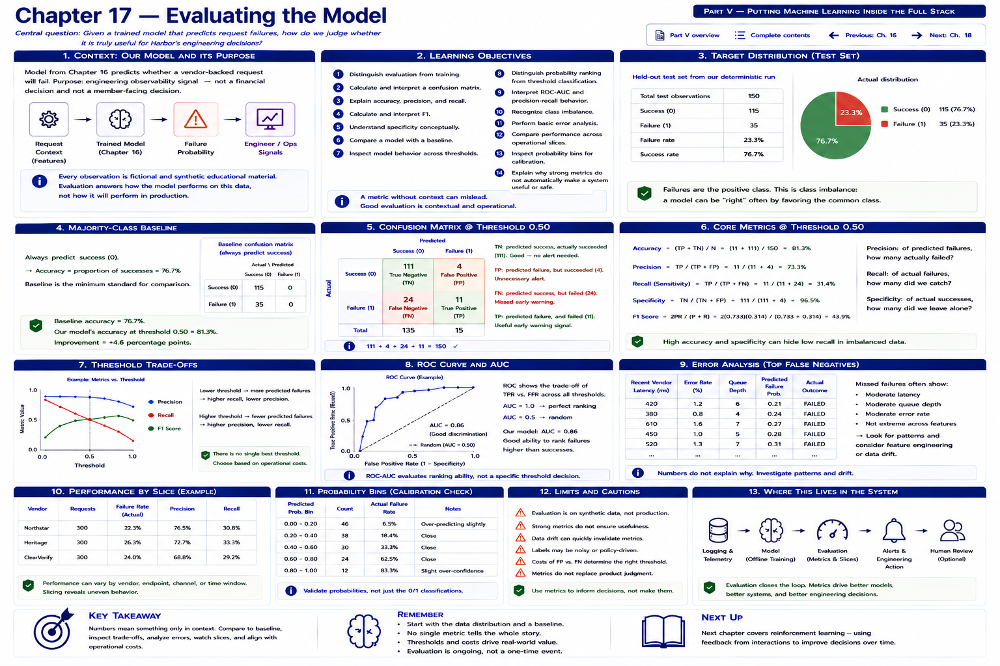

# Chapter 17 — Evaluating the Model



Harbor Federal Credit Union now has a reproducible training workflow. The command produces `model.joblib` and `metadata.json`, and prints several metrics. A developer sees:

```text
Accuracy: 84%
```

and asks, **“Is 84% good?”** The number alone cannot answer. The team must know how common failures are, what a naive baseline achieves, how many failures were missed, how many successes were flagged, which threshold was used, whether behavior is stable across technical slices, and what each error costs operationally.

```text
84% ACCURACY

means little without context
```

This chapter continues to use Chapter 16's `request_failed` model. Its narrow purpose is unchanged:

> Provide an engineering observability signal that a vendor-backed request may be at elevated risk of failure.

It is not a member-facing financial decision. Every observation is fictional, and evaluation on synthetic data cannot establish production performance.

```text
MODEL METRICS
      +
BASELINE
      +
THRESHOLD BEHAVIOR
      +
ERROR ANALYSIS
      +
OPERATIONAL CONSEQUENCES
      =
ENGINEERING EVALUATION
```

## Learning objectives

By the end of this chapter, you should be able to:

1. distinguish evaluation from training;
2. calculate and interpret a confusion matrix;
3. explain accuracy, precision, and recall;
4. calculate and interpret F1;
5. understand specificity conceptually;
6. compare a model with a baseline;
7. inspect model behavior across thresholds;
8. distinguish probability ranking from threshold classification;
9. interpret ROC-AUC and precision-recall behavior conceptually;
10. recognize class imbalance;
11. perform basic error analysis;
12. compare performance across operational slices;
13. inspect probability bins as a simple calibration check; and
14. explain why strong metrics do not automatically make a system useful or safe.

## Evaluation is not training

Training estimates model parameters from `X_train` and `y_train`. Evaluation applies the fitted model to observations it did not fit and asks whether its outputs meet an engineering need. Chapter 17 reconstructs Chapter 16's deterministic split, trains through the existing workflow, and obtains **one** held-out probability vector. Every default classification, threshold row, error example, slice, and probability bin is derived from that same vector.

That separation matters. Evaluation must not secretly refit preprocessing or tune parameters on the test outcomes.

## Start with the target distribution

Run the laboratory from the repository root:

```bash
python examples/chapter_17_model_evaluation.py
```

The committed data and Chapter 16 configuration produce this actual held-out distribution:

```text
Test observations: 150

Success: 115
Failure: 35

Failure rate: 0.233
```

Failures are the positive class. They represent 23.3% of the test set; successes represent 76.7%. This distribution supplies the missing context for accuracy. A classifier can be right frequently merely by favoring the common class. This is **class imbalance**, even though this example is not as extreme as many real operational datasets.

Evaluation data must also resemble intended deployment: expected vendors, endpoints, traffic conditions, failure prevalence, and time period. A perfectly calculated metric on irrelevant or stale data is still irrelevant. The synthetic fixture is an executable teaching instrument, not evidence about real Harbor traffic.

## Establish the majority-class baseline

The simplest baseline always predicts the majority class. Here that means always predicting success:

```text
success = 76.7%
failure = 23.3%

always predict success
→ 76.7% accuracy
```

The actual Chapter 17 model at threshold 0.50 reaches 81.3% accuracy, an improvement of only 4.7 percentage points:

```text
baseline accuracy = 0.767
model accuracy    = 0.813
```

Similarly, an illustrative model with 84% accuracy against an 82% baseline adds only two points. That is a reason to investigate—not proof that the model is useful. A baseline creates a minimum comparison, not a complete acceptance test.

## Read the confusion matrix in Harbor's context

For positive label `failure`, the matrix is:

```text
                        PREDICTED

                    success   failure

ACTUAL success         TN        FP

ACTUAL failure         FN        TP
```

At threshold 0.50, the laboratory computes:

```text
                        PREDICTED
                    success   failure
ACTUAL success         111         4
ACTUAL failure          24        11
```

The four cells reconcile exactly: `111 + 4 + 24 + 11 = 150` test observations.

- **True negative (TN):** the model predicts success and the request succeeds. There are 111.
- **True positive (TP):** the model predicts failure and the request fails. There are 11 useful early-warning signals.
- **False positive (FP):** the model predicts failure but the request succeeds. The four false alarms might cause extra diagnostic context, unnecessary monitoring, or an unnecessary alert.
- **False negative (FN):** the model predicts success but the request fails. For these 24 misses, developers receive no early warning and see the failure only after it happens.

“Positive” does not mean good, bad, approved, or suspicious. It means label `1`, which this model defines as request failure.

## Accuracy

```text
accuracy =
TP + TN
--------------------
all observations
```

Here, `(11 + 111) / 150 = 0.813`. Accuracy asks how often the binary label is correct overall. It combines two kinds of correct result but says nothing directly about which errors occurred. When failure is uncommon, many correct successes can hide poor failure detection. The 81.3% result coexists with 31.4% recall: most failures were missed.

## Precision

```text
precision =
TP
--------
TP + FP
```

Here, `11 / (11 + 4) = 0.733`.

> Of the requests the model flagged as likely failures, how many actually failed?

Precision matters when false alarms consume attention or trigger costly work. It is undefined if the model predicts no positives; the aggregate helper returns zero for safe arithmetic, while slice output prints `N/A` so “undefined” is not mistaken for measured zero performance.

## Recall

```text
recall =
TP
--------
TP + FN
```

Here, `11 / (11 + 24) = 0.314`.

> Of the requests that actually failed, how many did the model identify?

Recall matters when missing an early warning is costly. High precision does not repair low recall: at 0.50, flags are usually correct, but the model catches fewer than one third of failures.

## F1 score

```text
F1 =
harmonic mean of precision and recall

F1 =
2 × precision × recall
------------------------
precision + recall
```

The default result is 0.440. The harmonic mean penalizes imbalance: `precision = high` with `recall = low` can still yield mediocre F1. F1 is convenient when one combined view of positive-class performance is wanted, but it ignores true negatives and operational costs. It is not universally the best metric.

## Specificity

```text
specificity =
TN
--------
TN + FP
```

Here, `111 / 115 = 0.965`.

> Of successful requests, how many does the model correctly leave unflagged?

Specificity is useful when false alarms matter. Its complement is the false-positive rate.

## Metrics are engineering questions

| Metric | Engineering question |
| --- | --- |
| Accuracy | How often is the binary classification correct overall? |
| Precision | When we flag a likely failure, how often is that label right? |
| Recall | How many actual failures do we catch? |
| Specificity | How many successful requests do we leave unflagged? |
| F1 | How balanced are precision and recall? |

Metric choice follows operational priorities. It should not follow whichever number looks largest.

## Probability versus classification

This distinction is central. Suppose the model outputs:

```text
failure probability = 0.63
```

At threshold 0.50 the classification is `failure`; at threshold 0.70 it is `success`. Neither the fitted model nor its 0.63 output changed. Only the policy changed:

```text
MODEL

probability
    │
    ▼
THRESHOLD POLICY
    │
    ▼
binary classification
```

The implementation makes this explicit with `apply_threshold`, `evaluate_threshold`, and `evaluate_thresholds`. The comparison is `probability >= threshold`, consistently including equality.

## Sweep thresholds instead of worshipping 0.50

The reusable evaluator calculates predicted failures, accuracy, precision, recall, specificity, F1, FP, and FN for each threshold. The actual laboratory output is:

```text
threshold predicted accuracy precision recall specificity F1    FP  FN
0.10             99    0.493     0.293  0.829       0.391 0.433  70   6
0.20             61    0.653     0.361  0.629       0.661 0.458  39  13
0.30             35    0.760     0.486  0.486       0.843 0.486  18  18
0.40             20    0.807     0.650  0.371       0.939 0.473   7  22
0.50             15    0.813     0.733  0.314       0.965 0.440   4  24
0.60              9    0.787     0.667  0.171       0.974 0.273   3  29
0.70              4    0.780     0.750  0.086       0.991 0.154   1  32
0.80              2    0.767     0.500  0.029       0.991 0.054   1  34
0.90              0    0.767     0.000  0.000       1.000 0.000   0  35
```

No model is refitted between rows. At 0.10, Harbor catches 82.9% of failures but produces 70 false alarms. At 0.70, it produces one false alarm but catches only 8.6% of failures.

```text
LOW-COST ALERT

false positives relatively inexpensive
→ perhaps prioritize recall

HIGH-COST ACTION

false positives expensive
→ perhaps prioritize precision
```

If a flag only adds inexpensive logs, Harbor might tolerate more false positives. If it launches an expensive manual investigation, Harbor might require higher precision. These are considerations, not a universal prescription.

Optimizing one metric can damage another. Lowering the threshold enough can “maximize recall” by flagging almost everything, making the signal operationally useless. An extreme high threshold can maximize observed precision while missing most failures. The objective is not a number in isolation.

The module also implements the coding exercise policy: among evaluated thresholds meeting `minimum_recall`, select the one with highest precision, breaking ties toward the higher threshold. With minimum recall 0.70, the current grid selects 0.10 (precision 0.293, recall 0.829). That is one explicit policy rule, not the correct threshold for every system.

## Scores provide a ranking before a decision

```text
Request A = 0.12
Request B = 0.46
Request C = 0.88
```

The model ranks C above B and B above A in estimated failure propensity. This ordering may help prioritize debugging even before Harbor chooses a binary policy. Thresholding turns the ranking into an action boundary.

## ROC behavior and ROC-AUC

As the threshold changes, a receiver operating characteristic (ROC) curve compares:

```text
threshold changes
      │
      ▼
true positive rate
versus
false positive rate
```

`true positive rate = recall`, while:

```text
false positive rate =
FP
--------
FP + TN
```

The laboratory uses `roc_auc_score(y_test, probabilities)` and obtains ROC-AUC 0.717. It deliberately passes probabilities, not thresholded labels.

> ROC-AUC summarizes how well the model ranks positive examples above negative examples across thresholds.

Conceptually, AUC 0.5 is approximately random ranking; values closer to 1 indicate stronger class separation. AUC is **not accuracy**. A useful-looking AUC neither selects an operating threshold nor proves the resulting alerts are useful, safe, timely, or reliable.

## Precision-recall behavior

Precision-recall analysis focuses directly on performance for the positive class. It can be particularly informative for imbalanced problems, where a large number of negatives influences ROC quantities. The threshold table supplies concrete precision/recall pairs, and `average_precision_score` summarizes ranking across them. This run's average precision is 0.504.

Average precision is not the same as precision at 0.50. Like AUC, it does not replace inspection of the operating point. No plotting dependency is needed for this textual analysis.

## Error analysis: metrics are a starting point

Evaluation should inspect actual mistakes, not stop at aggregate scores. `collect_error_examples` joins prediction results to held-out feature rows. It sorts false positives from highest failure probability and false negatives from lowest failure probability. These are **confident errors**: especially valuable debugging examples because the model was strongly wrong.

One actual false negative from the deterministic split is:

```text
FALSE NEGATIVE

vendor: HarborLink Core Gateway
endpoint: account_summary
recent_vendor_latency_ms: 100.0
recent_vendor_error_rate: 0.1309
queue_depth: 0
retry_count: 0
probability: 0.0455
actual: failure
```

One false positive is:

```text
FALSE POSITIVE

vendor: Northstar Payments
endpoint: transfer_status
recent_vendor_latency_ms: 499.0
recent_vendor_error_rate: 0.2345
queue_depth: 0
retry_count: 3
probability: 0.8387
actual: success
```

Why did the model miss or overflag these? Plausible hypotheses include a missing feature, noisy label, unusual combination, rare endpoint behavior, insufficient examples, or distribution shift. They are questions for investigation—not root causes established by these rows. Error analysis might lead to telemetry review, label validation, or a new experiment, but it must not invent a story.

## Inspect non-sensitive technical slices

Aggregate metrics can hide uneven behavior across technical contexts. The evaluator groups the same held-out predictions by `vendor` and `endpoint`, calculating row count, failure rate, accuracy, precision, and recall. It uses no protected demographic characteristics.

Actual vendor results at 0.50 include:

```text
vendor                    n failure accuracy precision recall
BlueCurrent Documents    40   0.225    0.850     1.000  0.333
ClearVerify              35   0.229    0.829     1.000  0.250
HarborLink Core Gateway  35   0.286    0.771     0.667  0.400
Northstar Payments       40   0.200    0.800     0.500  0.250
```

Vendor recall ranges from 0.250 to 0.400 in this particular run. Endpoint behavior varies too: `transaction_history` recall is 0.800 across 14 rows, while `account_summary` recall is 0.000 across 21 rows. These observations warrant investigation; they do not establish a persistent difference.

Counts must always accompany slice metrics. An endpoint with `n = 3` and 100% accuracy supplies weak evidence. Precision is mathematically undefined if a slice has no predicted positives; recall is undefined if it has no actual positives. The slice helper preserves these cases as `None`, and the laboratory prints `N/A` rather than manufacturing a rate.

Slice counts also reconcile to 150 separately for vendors and endpoints. Grouping should neither lose nor duplicate evaluated observations.

## Calibration and probability bins

Ranking and calibration are different. If a model is well calibrated, then among many observations predicted near 0.70, roughly 70% should actually be positive. Real models need not be perfectly calibrated, especially across changing conditions.

A simple educational check groups the same scores into fixed bins:

```text
Prediction bin  Count  Avg predicted  Actual failure rate
0.0–0.2            89          0.101                0.146
0.2–0.4            41          0.278                0.220
0.4–0.6            11          0.492                0.636
0.6–0.8             7          0.675                0.714
0.8–1.0             2          0.842                0.500
```

All 150 observations appear exactly once; a probability of 1.0 belongs to the last bin. Large average-probability versus observed-rate differences suggest raw probabilities should not be interpreted too literally. Here the last bin contains only two rows, so its gap is particularly uncertain. This coarse check is not a full calibration study.

## A small structured report

`src/harbor_ml/model_evaluation.py` provides frozen dataclasses for classification, threshold, slice, and probability-bin results. `EvaluationReport` collects:

- target counts;
- baseline accuracy;
- default-threshold metrics;
- ROC-AUC and average precision;
- the threshold table;
- technical slice metrics; and
- probability bins.

`to_json()` serializes the structure for inspection without creating a reporting framework. Metrics remain derived values: editing JSON would not improve the fitted model. Chapter 16 metadata already records accuracy, precision, recall, F1, and baseline accuracy; Chapter 17 therefore avoids a broad training rewrite.

## Set acceptance criteria before deployment

A team should define evidence requirements before looking for a flattering threshold. Depending on the intended action, criteria might include:

- outperform the relevant baseline;
- meet a minimum recall;
- stay below a maximum false-positive rate;
- include a minimum evaluation sample size; and
- behave acceptably across major endpoints.

There is no universal numerical standard.

```text
MODEL ACCEPTANCE
=
technical metrics
+
operational requirements
+
safety constraints
```

Acceptance should also say who responds to a signal, within what time, and what happens when the model is unavailable.

## A good offline model is not a useful production system

```text
GOOD OFFLINE MODEL
          ≠
GOOD PRODUCTION SYSTEM
```

Excellent offline metrics can still fail operationally because predictions arrive too late, required features are unavailable, alert volume is excessive, integration is unreliable, the artifact is stale, users ignore the output, or the action policy is poorly designed. Conversely, modest ranking performance might still assist low-cost prioritization if the complete workflow is reliable and its limitations are clear.

Strong metrics do not automatically make a model safe. This observability signal must not silently migrate into authorization, member treatment, or a financial decision.

## Protect the independence of the test set

A repeated loop creates a subtle leak:

```text
train
check test set
change model
check same test set
change model
...
```

Even without fitting directly on test rows, developers are tuning decisions to that test set. It is no longer a clean independent estimate. Larger workflows commonly separate:

```text
training set
→ fit

validation set
→ tune

test set
→ final evaluation
```

The laboratory keeps Chapter 16's two-way split for focus; do not use its test results for endless model or threshold selection. Cross-validation can preview variability across multiple stratified splits by reporting a mean and fold-to-fold variation. It does not cure irrelevant data, leakage, temporal shift, or repeated selection. A full cross-validation implementation is intentionally deferred because it is not needed to learn the chapter's central evaluation workflow.

## Exercises

### Exercise 1 — Confusion matrix

Given `TP = 30`, `TN = 150`, `FP = 20`, and `FN = 10`, calculate accuracy, precision, and recall. State each denominator before calculating.

### Exercise 2 — F1

Given `precision = 0.75` and `recall = 0.60`, calculate F1. Why is it below the arithmetic mean?

### Exercise 3 — Baseline

Suppose 90% of requests succeed and 10% fail. What accuracy does an always-success model achieve? Why might 91% model accuracy still be unimpressive?

### Exercise 4 — Threshold

For probability 0.62, determine the classification at thresholds 0.40, 0.60, and 0.80. Which component changed?

### Exercise 5 — Operational tradeoff

For a cheap logging-only alert, might precision or recall matter more? Explain why low false-positive cost can favor recall—and why there is still no universal answer.

### Exercise 6 — Slice evaluation

Why should Harbor inspect endpoint and vendor separately? What conclusions should it avoid when a slice is tiny?

### Exercise 7 — Calibration

If observations predicted near 0.80 fail only 40% of the time, what concern does that raise? What sample-size information would you request?

### Coding exercise — Threshold policy

Use `select_threshold_for_minimum_recall` or implement an equivalent helper that accepts `minimum_recall` and chooses the highest-precision evaluated threshold meeting it. Then:

1. test eligibility, tie-breaking, invalid input, and no eligible threshold;
2. run it on the Harbor model;
3. print the selected threshold and metrics; and
4. explain why this is an example policy rule rather than a universally correct selection method.

## Key takeaways

1. Evaluation begins with the target distribution and baseline.
2. Accuracy alone can hide important failure behavior.
3. Precision and recall answer different operational questions.
4. F1 summarizes precision/recall balance but is not universally best.
5. A threshold converts probabilities into operational classifications.
6. ROC-AUC measures ranking across thresholds, not default-threshold accuracy.
7. Error analysis can surface missing-feature, noisy-label, and unusual-condition hypotheses.
8. Aggregate metrics can hide poor behavior in important technical slices.
9. Raw probabilities may not be perfectly calibrated.
10. Strong offline metrics do not automatically create a useful production system.

## What comes next: Chapter 18 — Serving a Model Through an API

Chapter 16 created a controlled model artifact. Chapter 17 established how to evaluate it. Now ask: **How does a full-stack application actually request a prediction?**

```text
Laravel / application
       │
       │ HTTP
       ▼
Python ML service
       │
       ▼
validated request
       │
       ▼
trusted model artifact
       │
       ▼
prediction response
```

Chapter 18 introduces a small Python prediction service with a request schema, validation, health endpoint, startup model loading, prediction endpoint, stable JSON response contract, and tests.

[Previous: Chapter 16](chapter-16-training-a-model-in-python.md) · [Next: Chapter 18](chapter-18-serving-a-model-through-an-api.md) · [Back to Part V](README.md) · [Complete contents](../../CONTENTS.md)
