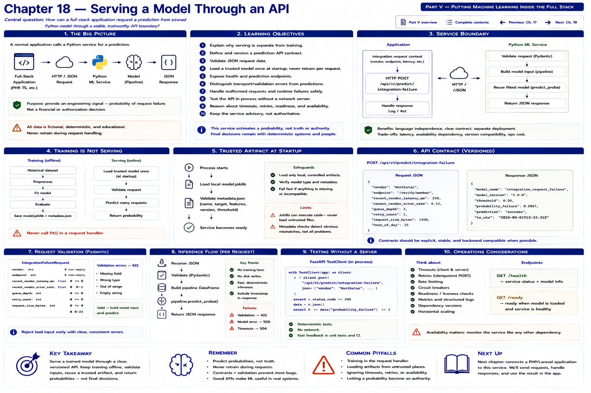

# Chapter 18 — Serving a Model Through an API



Harbor Federal Credit Union now has:

```text
training data → repeatable training workflow → evaluated model → trusted model artifact
```

But Harbor's digital banking application is not itself a scikit-learn program. It may be PHP/Laravel or JavaScript/TypeScript while the fitted model executes in Python. The developer needs a clear boundary:

```text
FULL-STACK APPLICATION
         │
         ▼
POST /predict/integration-failure
         │
         ▼
PYTHON SERVICE → MODEL → JSON
```

The central question is: **How can a normal full-stack application request a prediction from a trained Python model without embedding ML training logic inside the application itself?** This is an API-design problem as much as an ML problem. The service estimates the fitted model's `request_failed` probability for a fictional vendor-backed integration request. It does not authorize transactions, determine member eligibility, or replace deterministic banking controls.

## Learning objectives

By the end of this chapter, you should be able to:

1. explain why model serving is separate from model training;
2. define and version a prediction API contract;
3. validate JSON request data;
4. load a trusted model once at application startup and never retrain per request;
5. expose health and prediction endpoints with stable JSON;
6. distinguish transport/validation errors from model predictions;
7. handle malformed requests and startup or inference failures safely;
8. test an ML API in process without a network server;
9. reason about timeouts, retries, readiness, and availability; and
10. explain why this ML service remains advisory rather than authoritative.

## The service boundary

```text
HARBOR APPLICATION
       │ HTTP / JSON
       ▼
PYTHON ML SERVICE
       ├── validate request
       ├── build model input
       ├── reuse trusted fitted pipeline
       └── calculate prediction
       ▼
JSON RESPONSE
```

FastAPI is a deliberately small boundary here. It supplies typed Pydantic request models, validation, JSON serialization, in-process test-client support, and OpenAPI. The application does not need to understand scikit-learn encoders, scalers, arrays, or serialized estimators.

```text
                   HARBOR APPLICATION

integration request context
          │
          ▼
HTTP POST /api/v1/predict/integration-failure
          │
          ▼
     FASTAPI SERVICE
          ├── request validation
          ├── model runtime
          └── trusted model artifact
          │
          ▼
    probability response
          │
          ▼
     HARBOR APPLICATION
          │
          ▼
observability / engineering logic
```

The boundary offers language independence, keeps Python model dependencies in Python, creates a clear versioned contract, allows separate deployment, and makes PHP/TypeScript integration conventional HTTP work. It also adds network latency, another service to operate, an availability dependency, timeout/retry decisions, version compatibility, and deployment complexity. A microservice is not automatically superior.

> Not every ML model needs its own HTTP service.

Batch scoring, a same-process Python application, precomputed scores, and scheduled jobs are valid alternatives. This textbook uses HTTP because Chapter 19 will connect a PHP application to this service.

## Training is not serving

```text
TRAINING SCRIPT                    PREDICTION SERVICE
historical data                    model.joblib
      │                                  │
      ▼                                  ▼
     fit()                         load once at startup
      │                                  │
      ▼                                  ▼
model.joblib                       predict many requests
```

Training learns state and writes controlled artifacts. Serving loads that learned state and applies it. This code is prohibited:

```python
@app.post("/predict")
def predict(...):
    model.fit(...)  # Wrong: costly, unstable, and changes the model during requests.
```

The Chapter 18 handler calls `predict_proba`; it never calls `fit`. Loading also occurs in `create_app`, not in the handler, so repeated requests reuse the same `ModelRuntime` and fitted pipeline.

## Trusted artifact startup

```text
process starts
      │
      ▼
load trusted local model.joblib
      │
      ▼
read and validate metadata.json
      │
      ▼
service becomes ready
```

`ModelRuntime.load` reuses Chapter 16's `load_trusted_model_artifact`. Serialized Python artifacts are code-like assets: load only a local file whose provenance, storage, and deployment Harbor controls. The service never downloads one. It checks the artifact is a fitted scikit-learn pipeline and checks metadata model name, target, feature lists, version, and threshold. These checks detect obvious mismatches; they do not make an untrusted joblib safe.

A missing, malformed, or incompatible required artifact raises a clear `RuntimeError` while the app is being created. The service does not silently construct an untrained model or claim readiness. The factory also accepts an already-created runtime, which is dependency injection: tests can supply isolated state without changing production code.

## API and model feature contracts

```text
API CONTRACT                         MODEL FEATURE CONTRACT
what clients send                    what fitted pipeline receives
```

They happen to align closely in v1, but they are conceptually different. The service validates an HTTP representation, then `to_model_request` creates Chapter 7's `IntegrationRequest`. That helper builds one row in the exact established feature order. The fitted pipeline still owns scaling and one-hot encoding; the service does not duplicate preprocessing.

Renaming `recent_vendor_latency_ms` to `vendor_latency` is a breaking API change unless client and server coordinate it. A PHP client serializing the old property would receive a validation error. Treat prediction contracts like every other application interface.

### Request contract

| Field | Type | Required | Meaning at request time | Valid value |
|---|---|---:|---|---|
| `vendor` | string | yes | Fictional integration vendor | Nonempty after trimming |
| `endpoint` | string | yes | Integration operation | Nonempty after trimming |
| `recent_vendor_latency_ms` | number | yes | Recent observed vendor latency | `>= 0` |
| `recent_vendor_error_rate` | number | yes | Recent failure fraction | `0..1` |
| `queue_depth` | integer | yes | Current queued work | `>= 0` |
| `retry_count` | integer | yes | Retries already attempted | `>= 0` |
| `request_size_bytes` | integer | yes | Request payload size | `> 0` |
| `hour_of_day` | integer | yes | Request-time UTC hour in this fixture | `0..23` |

Pydantic's `Field(ge=...)`, `Field(le=...)`, and `Field(gt=...)` mean greater-than-or-equal, less-than-or-equal, and strictly greater-than. `StringConstraints(strip_whitespace=True, min_length=1)` normalizes and rejects blank categories. `ConfigDict(extra="forbid")` prevents unnoticed misspelled fields. FastAPI turns schema failures into HTTP `422` responses before inference runs.

An unknown vendor can still pass the API string validation. Chapter 7's fitted `OneHotEncoder(handle_unknown="ignore")` represents its unknown category without raising. **Acceptance does not mean the model understands that vendor well.** Monitoring and evaluation must cover novel-category behavior.

### Response contract

| Field | Type | Meaning |
|---|---|---|
| `model` | string | Stable model family name |
| `model_version` | string | Artifact version that produced this result |
| `failure_probability` | number | Fitted probability for synthetic target class `request_failed = 1` |
| `threshold` | number | Metadata classification threshold used for this response |
| `predicted_failure` | boolean | Whether probability is greater than or equal to threshold |

A representative shape is:

```json
{
  "model": "harbor-integration-failure",
  "model_version": "harbor-integration-failure-…",
  "failure_probability": 0.61,
  "threshold": 0.5,
  "predicted_failure": true
}
```

The executable values come from the model; they are not hard-coded. The threshold comes from Chapter 16 metadata instead of a second API-specific setting. `failure_probability` is the model output for this request's synthetic failure target—not “probability the vendor is broken” and not “probability this request should be blocked.” The runtime finds class label `1` in the fitted classifier's classes rather than assuming probability column 1 is positive.

The response omits paths, traceback text, estimator objects, arbitrary training metadata, and server configuration. `model_version` remains because it answers, “Which model produced this prediction?” during deployment and debugging.

## Versioned endpoints

Chapter 18 implements exactly:

```text
GET  /api/v1/health
POST /api/v1/predict/integration-failure
```

API versioning protects clients from accidental contract changes. The prefix does not require multiple versions today. No `/approve-transfer`, `/deny-member`, or `/fraud-score` endpoint exists.

The health response is intentionally small:

```json
{
  "status": "ok",
  "model_loaded": true,
  "model_name": "harbor-integration-failure",
  "model_version": "harbor-integration-failure-…"
}
```

**Liveness** asks whether the process runs. **Readiness** asks whether it can actually serve predictions. This teaching endpoint combines the concepts because app creation requires a usable runtime. If model startup fails, there is no successful readiness response. Larger systems often split the checks so orchestration can distinguish restart from temporary removal from traffic.

## Prediction and controlled errors

A valid handler execution is:

```text
JSON → Pydantic validation → IntegrationRequest → one feature row
     → fitted pipeline.predict_proba → class-1 probability
     → metadata threshold → typed JSON response
```

Failures have different meanings:

| Failure | HTTP/startup behavior | Is it a prediction? |
|---|---|---|
| Missing field, `hour_of_day: 30`, or nonnumeric latency | `422` | No |
| Unknown category supported by encoder | `200`, with caution | Yes |
| Missing/invalid required artifact | App creation fails clearly | No |
| Unexpected inference exception | Controlled `500` | No |

The unexpected-error handler logs the internal exception but returns only `{"detail":"prediction could not be calculated"}`. A client must never interpret a `422`, `500`, timeout, or connection failure as a low failure probability. Transport availability and prediction semantics are separate.

Minimal structured-style logs record endpoint, success/failure, model version, and latency. They do not log request bodies. Even though these fixtures contain synthetic operational fields, omission establishes a safer default. There is no prediction database in this chapter.

## Run locally

Install the focused runtime and development dependencies:

```bash
python -m pip install -r requirements-dev.txt
```

First generate Harbor-controlled local artifacts with Chapter 16's command, then start the factory:

```bash
python scripts/train_integration_failure_model.py
uvicorn harbor_ml.api:create_app --factory --reload
```

The defaults are `artifacts/integration-failure/model.joblib` and `metadata.json`. Controlled deployments may set `HARBOR_MODEL_PATH` and `HARBOR_MODEL_METADATA_PATH` to trusted local paths. They are locations, not download URLs.

Request a prediction:

```bash
curl -X POST \
  http://127.0.0.1:8000/api/v1/predict/integration-failure \
  -H 'Content-Type: application/json' \
  -d '{
    "vendor": "ClearVerify",
    "endpoint": "identity_verify",
    "recent_vendor_latency_ms": 940,
    "recent_vendor_error_rate": 0.031,
    "queue_depth": 42,
    "retry_count": 1,
    "request_size_bytes": 2400,
    "hour_of_day": 14
  }'
```

During local development, FastAPI exposes interactive OpenAPI documentation at `http://127.0.0.1:8000/docs`. Generated docs help inspect and try the schema; they do not replace maintained conceptual and client documentation.

## Test without a server

```text
temporary trained model
       │
       ▼
app factory
       │
       ▼
FastAPI TestClient
       │
       ▼
HTTP-like request in process
```

`tests/test_model_api.py` trains from the fictional fixture, saves model and metadata below pytest's `tmp_path`, builds the app, and calls it in process. No committed binary and no TCP port are required. Tests cover one-time loading, health metadata, actual bounded probabilities, threshold logic, determinism, malformed and missing fields, invalid hours, unknown categories, missing artifacts, controlled inference errors, metadata compatibility, and proof that `fit` is not invoked.

Run the executable laboratory:

```bash
python examples/chapter_18_model_api.py
```

It follows the same isolated design, shows health and real prediction JSON, submits an invalid hour for `422`, and sends an unknown fictional vendor. Temporary artifacts disappear afterward. For pedagogy it trains first; the API request handler never trains.

## Availability, timeouts, and retries

A caller needs a finite timeout; it must not hang forever. `application timeout = 500 ms` might be an example selected from measured latency and operational needs, not a universal value. Chapter 19 will place that decision in the client.

Retrying a prediction is generally safe when inference is read-only and deterministic for the same input and model. Retries can still amplify load during an outage, so they require bounds and backoff rather than reflexive loops. This chapter does not build a retry subsystem.

Most importantly:

```text
ML SERVICE AVAILABLE                 ML SERVICE UNAVAILABLE
      │                                      │
      ▼                                      ▼
prediction assists observability     core application continues
                                     deterministic operation
```

The advisory service is an optional engineering signal. Its unavailability must not prevent normal banking business logic, authorization, accounting, or eligibility rules from applying.

## API response versus engineering decision

```json
{
  "failure_probability": 0.72,
  "predicted_failure": true
}
```

This does **not** mean “block request.” Harbor might add structured telemetry, increase diagnostic logging, annotate an engineering dashboard, or retain the signal through an already-approved observability workflow for later analysis. The threshold classification is distinct from the probability, and both are distinct from an application action.

## Security and deployment boundary

Practical rules for this service are:

- do not publicly expose it without authentication, network controls, and TLS appropriate to the environment;
- treat model artifacts as trusted code-like assets with controlled provenance;
- validate all input and reject unrecognized fields;
- avoid sensitive request bodies and secrets in logs;
- run the process with least privilege;
- embed no secrets in source code; and
- keep health responses minimally informative.

Chapter 18 documents local execution only. Containers, process managers, TLS, authentication, service discovery, secret management, scaling, and external deployment remain production design work; they are not implemented here.

## Exercises

### Exercise 1 — Training or serving?

Classify `model.fit(...)`, `model.predict_proba(...)`, loading `model.joblib`, writing `metadata.json`, and handling `POST /predict`. **Answer:** fitting and writing training metadata belong to training; loading, predicting, and handling the request belong to serving.

### Exercise 2 — API or model feature?

Suppose `request_id` is added for tracing. Should it automatically become an ML feature? **No.** Transport correlation supplies no legitimate operational signal merely because it appears in JSON.

### Exercise 3 — Invalid request

What should happen to `{"hour_of_day": 28}`? Pydantic should reject it with `422`; inference should not run. If that is the entire body, missing required fields also produce validation errors.

### Exercise 4 — Model unavailable

Should deterministic integration logic stop because the advisory model cannot load? No. Fail service startup clearly, remove it from prediction traffic, and let core rules continue safely.

### Exercise 5 — Contract change

Why can renaming a field break PHP? Its serialized DTO still sends the v1 name while the changed server expects another. Coordinate a compatible migration or new API version.

### Exercise 6 — Prediction meaning

Why does `failure_probability = 0.80` not mean “the vendor is 80% broken”? The value applies the fitted synthetic request-outcome model to one feature row. It neither measures a vendor-wide condition nor establishes causation.

### Coding exercise — tracing metadata

Add optional `request_id` and then:

1. validate it as nonempty when present;
2. echo it in the response;
3. test that `to_model_request()` contains only the eight established features;
4. add it to structured logs without logging the body; and
5. explain `API/TRACING FIELD ≠ ML FEATURE`.

Do not add it to training data or the fitted feature matrix merely because the API carries it.

## Key takeaways

1. Model training and serving are separate workflows.
2. Load a trusted fitted model once and reuse it.
3. Keep API contracts stable, typed, versioned, and validated.
4. Keep learned preprocessing inside the fitted pipeline.
5. Health/readiness checks expose model availability.
6. Probability, threshold, and binary classification are distinct.
7. Never confuse API errors with model predictions.
8. An HTTP model introduces network and operational dependencies.
9. Advisory ML failure must not disable deterministic banking controls.
10. Serving a model is fundamentally software and API engineering.

## What comes next: Chapter 19 — Integrating Machine Learning with PHP

Chapter 18 created a Python ML service. Next, Harbor will connect it to the application stack:

```text
PHP / Laravel-style application
        │
        ▼
HTTP client → Python prediction API → prediction DTO
        │
        ▼
application observability logic
```

Chapter 19 covers an ML API client abstraction, request and response DTOs, timeouts, failure handling, retry and fallback thinking, dependency injection, and automated tests—while never making the ML service authoritative for core financial behavior.

[Previous: Chapter 17](chapter-17-evaluating-the-model.md) · [Next: Chapter 19](chapter-19-integrating-machine-learning-with-php.md) · [Back to Part V](README.md) · [Complete contents](../../CONTENTS.md)
