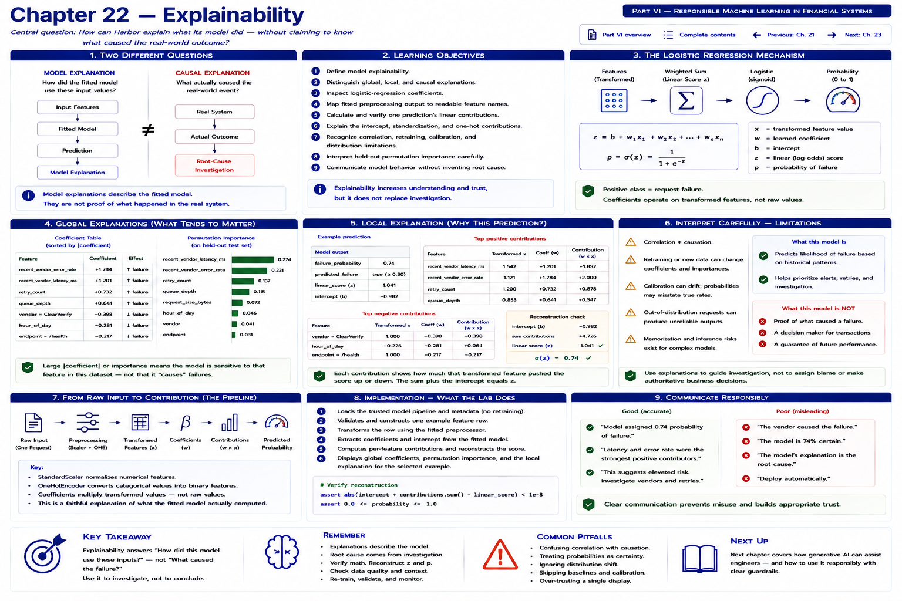

# Chapter 22 — Explainability



A Harbor Federal Credit Union developer receives:

```text
failure_probability = 0.74
predicted_failure = true
```

and asks, “Why did the model predict that?” The question has two importantly different meanings. “Which input values pushed the model toward failure?” is an explainability question. “Why did the vendor request actually fail?” is a root-cause question.

```text
MODEL EXPLANATION                 CAUSAL EXPLANATION
How did the fitted model          What actually caused the
use these input values?     ≠     real-world event?
```

```text
INPUTS                            REAL SYSTEM
  │                                  │
  ▼                                  ▼
FITTED MODEL                     vendor / network / application /
  │                              database behavior
  ▼                                  │
PREDICTION                           ▼
  │                              actual outcome
  ▼                                  │
MODEL EXPLANATION                    ▼
                                 ROOT-CAUSE INVESTIGATION
```

This chapter builds transparent internal tooling around Harbor's already-trained integration request-failure logistic regression. An explanation describes the fitted model. It is not proof of what happened in the real system.

## Learning objectives

By the end, you can:

1. define model explainability;
2. distinguish global, local, and causal explanations;
3. inspect logistic-regression coefficients;
4. map fitted preprocessing output to readable feature names;
5. calculate and verify one prediction's linear contributions;
6. explain the intercept, standardization, and one-hot contributions;
7. recognize correlation, retraining, calibration, and distribution limitations;
8. interpret held-out permutation importance carefully; and
9. communicate model behavior without inventing root cause.

## Global and local explanations

```text
GLOBAL EXPLANATION
How does the fitted model generally use features?

LOCAL EXPLANATION
Why did the model score this particular request the way it did?
```

Coefficients, permutation importance, and class-level feature patterns are global views. Transformed values and their per-feature contributions are local views.

```text
GLOBAL  "What tends to matter to this model?"
LOCAL   "What influenced this prediction?"
```

Neither asks what caused an actual outage.

## Logistic regression recap

```text
features → weighted combination → linear score → logistic transformation → probability
```

The model computes:

```text
z = b + w1x1 + w2x2 + ... + wnxn
p = sigmoid(z)
```

Here `x` is a **transformed** feature value, `w` is its learned coefficient, `b` is the intercept, `z` is the linear or log-odds score, and `p` is the probability. The positive class is request failure.

## Recover names from the fitted pipeline

Harbor's actual contract has numerical features `recent_vendor_latency_ms`, `recent_vendor_error_rate`, `queue_depth`, `retry_count`, `request_size_bytes`, and `hour_of_day`, plus categorical `vendor` and `endpoint`. The pipeline applies `StandardScaler` and `OneHotEncoder`.

Column order must not be guessed. The laboratory calls:

```python
names = pipeline.named_steps["preprocessor"].get_feature_names_out(
    PREDICTION_FEATURES
)
```

It retains exact names such as `numeric__queue_depth` and `categorical__vendor_ClearVerify`, while displaying `queue_depth` and `vendor=ClearVerify`. That pairing prevents a readable label from losing its exact fitted mapping.

Run the executable laboratory to print the coefficients actually learned from the committed synthetic dataset:

```bash
python examples/chapter_22_explainability.py
```

It sorts the global table by absolute coefficient. A larger absolute coefficient means the fitted linear model changes its score more strongly when that transformed feature changes, all else equal **within the model representation**. It does not mean the feature is the real cause.

## Standardization matters

A raw `queue_depth = 90` is not necessarily the value multiplied by the coefficient:

```text
RAW FEATURE
   │
   ▼
StandardScaler
   │
   ▼
TRANSFORMED FEATURE
   │
   ▼
coefficient × transformed value
```

Depending on the training mean and standard deviation, 90 might become 1.42. A correct local explanation transforms the complete row through the fitted preprocessor first. Multiplying coefficients by raw numerical inputs would be mathematically wrong.

## Exact local contributions

For this binary linear model:

```text
contribution_i = coefficient_i × transformed_feature_i
z = intercept + sum(contributions)
```

`FeatureContribution` records the readable name, exact transformed name, transformed value, coefficient, and contribution. `LocalExplanation` records the model name and version, intercept, all contributions, score, and probability.

The implementation performs six checksable steps: validate and construct one feature row; transform it; retrieve fitted names and coefficients; multiply aligned values; add the intercept; apply sigmoid. Tests verify the result matches `predict_proba` within floating-point tolerance. This makes the explanation a decomposition of the real computation, not decorative prose.

```text
positive contribution
→ pushes the linear score toward the positive/failure class

negative contribution
→ pushes the linear score away from the positive/failure class
```

“Positive” does not mean a feature is intrinsically bad, and neither direction establishes causality.

### The intercept

```text
linear score =
intercept
+
feature contributions
```

Even when transformed contributions are zero, the model begins at its fitted intercept. This is a baseline in transformed model space, not an observed request feature and not necessarily the raw population failure rate.

### One-hot categories

For `vendor = ClearVerify`, one-hot encoding activates `vendor_ClearVerify = 1`; other known vendor indicators are zero. The active indicator's coefficient contributes to the score. In this synthetic fitted model, the category carries a learned association relative to the encoding and model setup. It does **not** establish that ClearVerify causes failure.

## The laboratory: two paths through one model

Scenario A uses elevated vendor latency and error-rate signals. Scenario B uses high queue depth with normal vendor metrics. The lab prints actual probabilities and the largest positive and negative contributions for each. Their rankings differ: the same fitted model can reach elevated scores through different transformed input combinations.

The output says:

```text
Interpretation: The fitted model relied on the transformed values above.
This does not establish the request's actual root cause.
```

That language is deliberate. Prefer “the model score increased because…,” “the model relied strongly on…,” or “this feature contributed positively to the fitted score.” Avoid “the request failed because…” without independent system evidence.

## Model sensitivity, not a causal counterfactual

The lab keeps one request fixed while setting `recent_vendor_latency_ms` to 300, 900, and 1600 milliseconds. `compare_feature_sensitivity` validates that no other field changes, then reports model probabilities.

This isolates the fitted model's mathematical response to one supplied value. It is a **model sensitivity experiment**, not a causal effect: real latency can co-vary with congestion, errors, load, and unobserved conditions.

## Global permutation importance

A second global view asks how predictive performance responds when a raw feature's information is disrupted:

```text
baseline evaluation score
        │
        ▼
shuffle one feature
        │
        ▼
evaluate again
        │
        ▼
performance drop
```

The implementation passes the held-out, original eight-column matrix directly to the fitted pipeline. Shuffling `vendor` therefore disrupts the raw category as a group rather than listing many independent one-hot indicators. It uses ROC-AUC because Chapter 17 established it as a threshold-independent ranking metric—not because it creates an attractive ranking. A different legitimate metric answers a different performance question.

```text
FEATURE IMPORTANCE
means
important to model performance

NOT
important cause in the real system
```

Permutation importance describes this model on this held-out synthetic sample. Correlated features can mask each other; a small set is noisy; results depend on the metric and random shuffles; and no value is causal.

## Correlation and model version

Vendor latency, vendor error rate, and queue depth may move together:

```text
CORRELATED FEATURES
       │
       ▼
multiple mathematical representations
may fit similarly
```

Regularized logistic regression may distribute weight among correlated signals differently after a feature or dataset change. Coefficients are model behavior, not immutable truth.

```text
same request
+
different model version
→ potentially different explanation
```

Different data, features, regularization, or learned categories can alter an explanation. Every local explanation therefore carries `model_name` and `model_version`, answering “which model is being explained?” and connecting explanation to Chapter 20's model-version observability.

## Explanations as engineering evidence

Keep four levels separate:

```text
LEVEL 1  prediction
LEVEL 2  model explanation
LEVEL 3  engineering hypothesis
LEVEL 4  validated root cause
```

For example:

```text
Prediction:             0.74 failure probability
Model explanation:      elevated vendor latency increased the fitted score
Engineering hypothesis: vendor performance may be contributing
Validation:             inspect vendor traces and responses
```

A dashboard could show “Model explanation — Top model contributions,” never “Root cause.” This chapter keeps that detail in the internal lab rather than expanding the stable Chapter 18 API or Chapter 20 dashboard.

Explainability resembles familiar debugging:

```text
DEBUGGING APPLICATION             DEBUGGING MODEL
inspect inputs                    inspect input features
inspect state                     inspect transformed values
inspect call path                 inspect contributions
inspect outputs                   inspect prediction
```

Yet traces, logs, response codes, database evidence, and controlled validation remain necessary for diagnosis.

## Security boundary

Chapter 21 showed that model inputs and operational output require allowlists. Explanations reveal feature names, categories, weights, and behavior that can aid probing. Harbor treats detailed explanations as internal engineering tools and does not expose them publicly without a legitimate, authorized need. The explanation structure contains only declared model features and model identity—no email, account number, password, token, or arbitrary payload.

## Limitations

A local explanation:

- describes only the fitted model;
- may explain an out-of-distribution input without warning;
- inherits ambiguity from correlated features;
- does not correct a miscalibrated probability;
- can change after retraining;
- does not validate that source features are fresh or correct; and
- does not reveal true root cause.

```text
INTERPRETABLE ≠ ACCURATE ≠ USEFUL ≠ SAFE
```

A transparent model can still perform poorly. Explanation complements—not replaces—evaluation, monitoring, data validation, access control, and engineering judgment.

## Exercises

### Exercise 1 — Explanation or cause?

Classify these statements:

1. “The fitted model assigned a large positive contribution to vendor latency.”
2. “The vendor failed because its latency was high.”

The first is a model explanation. The second is a causal claim requiring independent evidence.

### Exercise 2 — Contribution

Given transformed value 1.5 and coefficient 0.8, calculate the contribution. It is `1.5 × 0.8 = 1.2` toward the positive-class linear score.

### Exercise 3 — Intercept

Why is the intercept part of prediction although it is not an input? Explain its role as the learned starting score before row-specific transformed contributions.

### Exercise 4 — One-hot category

If `vendor_ClearVerify = 1` and `vendor_Northstar = 0`, which vendor coefficient contributes? Explain why the answer is association, not cause.

### Exercise 5 — Correlation

Why can correlated features make coefficient interpretation unstable even when predictive performance remains similar?

### Exercise 6 — Permutation importance

Answer: “How much does model evaluation performance change when this feature's information is disrupted?” Do not answer: “How causal is this feature?”

### Coding exercise — sensitivity comparison

Extend or call `compare_feature_sensitivity` with a base request, `recent_vendor_error_rate`, and several values. Print each probability under a “Model sensitivity (not causal effect)” label. Assert every field other than the selected feature equals the base request. Consider how invalid values and nonnumerical feature names should fail.

## Key takeaways

1. Explainability describes model behavior, not real-world causation.
2. Global explanations describe overall fitted-model patterns; local explanations describe one prediction.
3. Logistic-regression coefficients operate on transformed features.
4. Local contributions plus the intercept reproduce the linear score exactly.
5. One-hot categories contribute through learned indicator coefficients.
6. Correlation complicates coefficient interpretation.
7. Permutation importance measures model reliance, not causality.
8. Explanations must identify the model version and use precise language.
9. Explainability does not guarantee accuracy, usefulness, or safety.
10. Root cause still requires traces, logs, system evidence, and validation.

## What comes next: Chapter 23 — Bias and Fairness

Chapter 22 asks, “How does the model use its features?” Chapter 23 will ask, “Could the model perform differently across groups or contexts in ways that create unfair or undesirable outcomes?” It will use safe operational slices such as channel, vendor, endpoint, and device category, and explain why excluding protected attributes alone does not automatically eliminate unfairness.

```text
overall metrics
      │
      ▼
slice metrics
      │
      ▼
compare errors
      │
      ▼
identify uneven behavior
```

Chapter 23 applies that progression to approved technical contexts, reporting counts,
base rates, precision, recall, false-positive rates, false-negative rates, and
low-support labels without introducing demographic data.

[Previous: Chapter 21](chapter-21-security-and-sensitive-financial-data.md) · [Next: Chapter 23 — Bias and Fairness](chapter-23-bias-and-fairness.md) · [Back to Part VI](README.md) · [Complete contents](../../CONTENTS.md)
