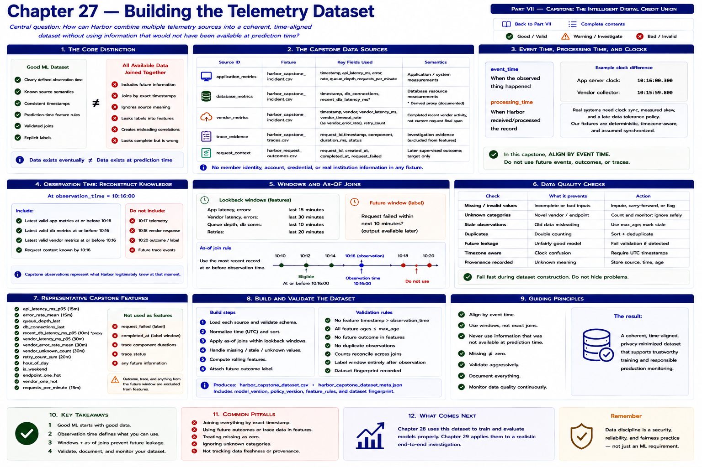

# Chapter 27 — Building the Telemetry Dataset



> **Part VII — Capstone: The Intelligent Digital Credit Union**

Chapter 26 showed the fictional **Harbor Federal Credit Union** incident as engineers experienced it over time. Behind that timeline are independent application, database, vendor, trace, and request-outcome records. A developer proposes: “Let's join everything by request ID and timestamp and train on all of it.” That is attractive—and wrong whenever a joined fact arrived after the prediction.

```text
GOOD ML DATASET
≠
all available data joined together
```

Instead:

```text
GOOD ML DATASET

clearly defined observation time
        +
known source semantics
        +
consistent timestamps
        +
prediction-time feature rules
        +
validated joins
        +
explicit labels
```

The central question is:

> How can Harbor combine application, vendor, database, trace, and request-outcome data into a coherent time-aligned dataset without accidentally using information that would not have been available at prediction time?

The governing distinction is:

```text
DATA EXISTS EVENTUALLY
        ≠
DATA EXISTS AT PREDICTION TIME
```

## Learning objectives

By the end, you will be able to:

1. define an observation timestamp;
2. distinguish event time from processing time;
3. define prediction-time feature and future label windows;
4. align several telemetry sources with as-of and time-window joins;
5. explain why exact timestamp joins are often inappropriate;
6. detect stale observations and handle missing telemetry deliberately;
7. distinguish missing from zero;
8. prevent future leakage;
9. construct rolling historical features and later-outcome labels;
10. validate temporal ordering and duplicate records;
11. preserve source provenance; and
12. build and fingerprint one reproducible capstone dataset.

## Source inventory and provenance

The laboratory reuses committed, deterministic fixtures rather than inventing member data.

| Source identifier | Fixture | Fields used | Semantics |
| --- | --- | --- | --- |
| `application_metrics` | `harbor_capstone_incident.csv` | `timestamp`, `api_latency_ms`, `error_rate`, `queue_depth`, `requests_per_minute` | system/application measurements |
| `database_metrics` | `harbor_capstone_incident.csv` | `timestamp`, `db_connections`; a documented teaching proxy for `recent_db_latency_ms` | database resource measurements |
| `vendor_metrics` | `harbor_capstone_incident.csv` | `timestamp`, vendor, `vendor_latency_ms`, `vendor_timeout_rate` as `vendor_error_rate`, `retry_count` | completed recent vendor activity, not the current request's final span |
| `trace_evidence` | `harbor_capstone_traces.csv` | `request_id`, `timestamp`, `component`, `duration_ms`, `status` | later investigation evidence, excluded from features |
| `request_context` | `harbor_request_outcomes.csv` | synthetic request ID, `created_at`, `completed_at`, `request_failed` | later supervised outcome; target only |

Chapter 26's compact telemetry fixture already contains application, database, and vendor columns at one event time. The loader exposes typed source views so semantic boundaries remain visible. Because that fixture has no database-latency measurement, Chapter 27 derives a plainly documented deterministic teaching proxy. It does **not** rename API or vendor latency as database latency. A production contract would require a real database instrument.

No silent semantic merging is allowed. `api_latency_ms`, `vendor_latency_ms`, and `recent_db_latency_ms` answer different questions even though each has units of milliseconds. Every feature can be traced to the mapping above; each rich observation also retains selected source timestamps and ages.

The data is fictional and privacy-minimized. It contains no member identity, account, credential, transaction, or real institution information.

## Event time, processing time, and the clock assumption

```text
event_time
→ when the observed thing happened

processing_time
→ when Harbor received/processed the record
```

A vendor event might happen at 10:14:02 while the collector receives it at 10:14:05. For this historical capstone, **event time** controls alignment. We do not build a distributed streaming system.

Distributed clocks can differ:

```text
app server clock:    10:16:00.300
vendor collector:    10:15:59.800
```

A real platform needs synchronization, measured skew, and an explicit tolerance/late-data policy. The committed fixtures are deterministic, timezone-aware, and assumed synchronized. That simplifying assumption must not be copied into a production design unnoticed.

## Observation time: reconstruct knowledge, not hindsight

> A capstone observation represents everything Harbor legitimately knows at one specific timestamp.

At `observation_time = 10:16:00`, Harbor may use the latest valid application, database, and vendor observations at or before 10:16, plus request context known by then. It may not use 10:17 telemetry, a 10:18 vendor response, a 10:20 outcome, or future trace events.

Historical supervised-data construction therefore asks:

> What would the model have known at that historical moment?

not:

> What do we know now after the incident is over?

```text
HINDSIGHT DATASET
 danger: uses facts learned later

PREDICTION-TIME RECONSTRUCTION
 goal: rebuild what was available then
```

This matters when granularity differs. A system metric may occur once per minute while many request records occur in that minute. For this capstone, the rule is: **use the most recent valid system observation at or before request prediction time**.

## As-of joins, not equality joins

An as-of join selects the newest source record satisfying:

```text
timestamp <= observation_time
```

and the source freshness rule.

```text
OBSERVATION TIME  10:16:00
application       10:15:58  eligible
 database         10:15:55  eligible
 vendor           10:16:01  NOT eligible
```

Exact equality is usually the wrong operational contract:

```text
application timestamp = 10:16:00
database timestamp    = 10:15:57
vendor timestamp      = 10:16:03
```

An equality join loses the useful database value and might leave no row. It must never “round” 10:16:03 backward and admit the future vendor record.

```text
TIME ALIGNMENT
does not require
identical timestamps
```

Inputs may arrive unsorted. Historical loaders validate then sort records by event time. Sorting a file is easy; a real stream must explicitly handle late arrivals, watermarks, retractions, and replay. Those systems are outside this chapter.

## Freshness and stale telemetry

The configurable fictional teaching defaults are:

| Source | Maximum age |
| --- | ---: |
| application metrics | 60 seconds |
| database metrics | 60 seconds |
| vendor metrics | 120 seconds |

They are not universal production values. If observation time is 10:16 and the latest vendor event is 10:08, the builder rejects the observation with `vendor_metrics too stale`; it does not silently reuse it.

```text
OLD VALUE
≠
CURRENT VALUE
```

A service might instead retain `vendor_telemetry_status = stale` and an approved missing indicator. This chapter chooses the conservative policy: **drop/reject an observation when a critical source or rolling feature is unavailable**. Correctness matters more than row count.

## Missing is not zero

This is a semantic distinction, not a CSV-format detail:

```text
retry_count = 0
```

means Harbor observed zero retries. In contrast:

```text
retry_count = missing
```

means Harbor has no valid value. Filling the second with zero creates a false assertion that the source observed healthy behavior. Chapter 27 neither imputes nor silently inserts zero. The lab demonstrates both an observed zero and stale-source rejection.

If a later model architecture supports imputation, the policy must be approved, fitted only on training data, accompanied by missingness indicators where appropriate, versioned, and evaluated. It is not an ad hoc requirement of “models need numbers.”

## Feature windows and rolling features

```text
FEATURE WINDOW
observation_time - lookback
        through
observation_time
```

Chapter 27 uses an inclusive five-minute event-time window: `[observation_time - 5 minutes, observation_time]`. Every selected timestamp is at or before prediction time. It constructs only a small understandable set:

- `vendor_latency_mean_5m` and `vendor_latency_max_5m`;
- `error_rate_mean_5m`;
- `requests_mean_5m`;
- `retry_count_5m`;
- `db_connections_mean_5m`; and
- `queue_growth_5m`.

Queue growth is:

```text
queue_growth_5m =
queue_depth_now - queue_depth_as_of(observation_time - 5 minutes)
```

Because the fixture samples every two minutes, the anchor may be just before the cutoff, subject to a two-minute anchor tolerance. If no sufficiently old observation exists, the feature is unavailable and that early row is not emitted. The code never substitutes an arbitrary value.

## The label window is separate

```text
FEATURE WINDOW
past/current data

PREDICTION TIME
      │
      ▼

LABEL WINDOW
future request completion
```

A prediction at 10:16:00 can later be paired historically with a request that completes at 10:16:08 and `request_failed = 1`. The future result may define the target. It may not define features.

Bad architecture gives one function unrestricted hindsight:

```python
build_training_row(request)
```

Better architecture enforces the boundary:

```python
features = build_capstone_observation(sources, prediction_time)
label = build_label(later_outcome, prediction_time)
```

```text
FEATURE BUILDER
cannot inspect future outcome

LABEL BUILDER
may inspect historical future outcome
```

`build_capstone_observation` does not read `sources.outcomes` or `sources.traces`. `build_label` requires the request to be known by prediction time and completed after it.

### Trace leakage is especially dangerous

Chapter 26 eventually records a ClearVerify span of roughly 2200 ms. Before that request finishes, its actual final duration and status do not exist. `current_request_vendor_duration_ms`, final status, and failure reason are prohibited features. Chapter 27 instead uses historical rolling vendor telemetry from completed prior activity.

Use `recent_vendor_latency_ms`; never use the current request's final duration before completion. Trace evidence remains valuable for retrospective diagnosis, but value for diagnosis does not imply prediction-time availability.

## Worked alignment

At `prediction_time = 10:16:00`, suppose Harbor has:

```text
application  10:15:58  api_latency=910  queue=68
database     10:15:54  connections=59
vendor       10:15:50  latency=1280  retry_count=2
outcome      10:16:09  failed=true
```

The reconstructed training example is:

```text
features:
  api_latency = 910
  queue = 68
  connections = 59
  vendor_latency = 1280
  retry_count = 2

target:
  request_failed = 1
```

The target is attached only after history is complete. Final status, final trace duration, and failure reason are excluded.

## Model-ready contract

The rich `CapstoneTrainingExample` contains observation time, numerical features, a separately known historical incident label, and provenance selections. The model matrix receives only `MODEL_FEATURES`.

```text
CAPSTONE OBSERVATION
rich structured record
        ↓
MODEL FEATURE MATRIX
selected numerical fields
```

Source ages are excellent validation/debug information, but are not automatically predictors. Neither provenance nor every useful investigation field belongs in the model.

| Name | Type | Source | Available at prediction? | Meaning | Validation rule |
| --- | --- | --- | --- | --- | --- |
| `api_latency_ms` | float | application | yes | latest API latency | finite, nonnegative, fresh |
| `error_rate` | float | application | yes | latest application error fraction | finite, 0–1, fresh |
| `queue_depth` | float | application | yes | latest queued work | finite, nonnegative, fresh |
| `requests_per_minute` | float | application | yes | latest request rate | finite, nonnegative, fresh |
| `db_connections` | float | database | yes | latest open connections | finite, nonnegative, fresh |
| `recent_db_latency_ms` | float | database | yes | explicitly named teaching DB-latency proxy | finite, nonnegative, fresh |
| `vendor_latency_ms` | float | vendor | yes | latest completed recent vendor latency | finite, nonnegative, fresh |
| `vendor_error_rate` | float | vendor | yes | latest recent vendor timeout/error fraction | finite, 0–1, fresh |
| `retry_count` | float | vendor | yes | latest observed retries; zero is valid | integer-like, nonnegative, fresh |
| `vendor_latency_mean_5m` | float | vendor | yes | mean in inclusive prior five minutes | nonempty past/current window |
| `vendor_latency_max_5m` | float | vendor | yes | maximum in prior five minutes | nonempty past/current window |
| `error_rate_mean_5m` | float | application | yes | mean error rate in prior five minutes | nonempty past/current window, 0–1 |
| `queue_growth_5m` | float | application | yes | current queue minus valid as-of anchor | valid sufficiently old anchor |
| `requests_mean_5m` | float | application | yes | mean request rate in prior five minutes | nonempty past/current window |
| `retry_count_5m` | float | vendor | yes | sum of observed retries in prior five minutes | nonempty past/current window, nonnegative |
| `db_connections_mean_5m` | float | database | yes | mean connections in prior five minutes | nonempty past/current window |
| `incident_type` | string | synthetic scenario history | **no—label only** | known historical taxonomy | one Chapter 5 class; absent from features |
| `request_failed` | integer | request outcome | **no—target only** | eventual binary outcome | 0/1; completion after prediction |

The base capstone CSV uses `incident_type` for Chapters 28 and 29: anomaly training selects `normal`; classification uses known synthetic labels. The fixture represents normal, vendor-degradation, and later database-pressure/compound periods. Counts for the other valid Chapter 5 classes are explicitly zero rather than fabricated. The label organizes synthetic historical examples; it is not a causal feature or a model prediction.

## Validation and duplicate policy

The loaders/builders enforce:

- parseable timezone-aware timestamps and sorted normalized records;
- finite, nonnegative counts/latencies and rates within 0–1;
- only the Chapter 5 incident taxonomy;
- absence of prohibited sensitive and hindsight fields;
- no source selection later than observation time;
- freshness for every as-of source;
- a nonempty past/current rolling window and valid queue anchor;
- labels separated from model features; and
- request outcomes completed after their prediction time.

Identical duplicates can be deduplicated only when equality is demonstrable. Records with the same source timestamp but conflicting values fail clearly. Without a sequence number, selecting an arbitrary “last” duplicate would make the dataset dependent on input order. The existing Chapter 26 loader is stricter and rejects non-increasing combined-fixture timestamps before source views are built.

## Reproducibility, version, and fingerprint

Run from the repository root:

```bash
python examples/chapter_27_building_telemetry_dataset.py
```

The lab loads every source, prints schemas/ranges, builds the 10:16 observation, displays source ages, separates a later label, demonstrates missing versus zero and stale rejection, performs the future-outcome leakage check, and prints actual class counts.

It writes derived, gitignored artifacts:

```text
artifacts/capstone-dataset/harbor_capstone_training_examples.csv
artifacts/capstone-dataset/metadata.json
```

The metadata records `harbor-capstone-dataset-v1`, generator `chapter-27-v1`, source SHA-256 hashes, output SHA-256, row count, and ordered feature names. Stable fixture bytes, ordering, formatting, and code produce the same fingerprint on repeated runs. This is a small manifest, not a data catalog.

The central leakage test builds two histories identical through prediction time with different later outcomes. Feature mappings must be identical; labels may differ. Other tests cover loading, parsing, sorting, future exclusion, freshness, stale rejection, rolling boundaries, queue growth, label separation, trace exclusion, duplicate conflicts, row count, privacy, and deterministic hashing.

## Exercises

### Exercise 1 — Feature or future data?

At prediction time 10:16, a vendor metric from 10:15:55 and queue depth from 10:15:58 are temporally eligible if fresh. A database metric from 10:16:04 and final request status from 10:16:09 are future data and ineligible.

### Exercise 2 — Missing versus zero

Explain why observed `retry_count = 0` asserts no retries, while unavailable retry count asserts no valid knowledge. What false operational claim would zero imputation introduce?

### Exercise 3 — As-of join

At 10:10:00 with records at 10:09:50 and 10:10:03, only 10:09:50 is eligible, subject to freshness.

### Exercise 4 — Staleness

Why might Harbor reject a row when its newest vendor metric is eight minutes old? Relate the answer to “old value ≠ current value” and distribution distortion.

### Exercise 5 — Leakage

Why can actual current-request vendor duration not be used before the vendor call completes? When may it become a retrospective label or diagnostic fact?

### Exercise 6 — Rolling window

For a five-minute average at time `t`, use only completed vendor observations whose event times are in the declared interval `[t - 5 minutes, t]`. Never use `t + ε`.

### Coding exercise — vendor error rolling mean

Add `vendor_error_rate_mean_5m`:

1. calculate it from completed vendor observations at or before prediction time;
2. add it to the capstone feature contract;
3. add freshness and empty-window handling;
4. update generation;
5. prove with tests that future events never enter the window; and
6. update the table above.

Do not silently impute an empty window.

## Key takeaways

1. A historical ML dataset reconstructs what was knowable at prediction time.
2. Event time and processing time are different.
3. As-of joins are often better than exact timestamp joins.
4. Source freshness must be explicit.
5. Missing and zero are not equivalent.
6. Rolling features may use only past/current observations.
7. Future outcomes may create historical labels, never prediction-time features.
8. Trace and post-incident evidence are especially dangerous leakage sources.
9. Provenance and semantic naming matter as much as model code.
10. Good training begins with a trustworthy temporal data contract.

## What comes next: Chapter 28 — Training the Anomaly Detector

Chapter 27 produces a validated dataset. Chapter 28 will ask:

> Can Harbor learn the multivariate shape of healthy capstone operation and detect when the incident timeline departs from it?

```text
NORMAL CAPSTONE OBSERVATIONS
        │
        ▼
selected numerical features
        │
        ▼
Isolation Forest
        │
        ▼
anomaly score
        │
        ▼
incident timeline
```

It will cover baseline selection, the feature contract, artifact and metadata, threshold semantics, and evaluation against synthetic incident periods—without claiming anomaly means root cause.

[Previous: Chapter 26 — The Harbor Incident](chapter-26-the-harbor-incident.md) · [Back to Part VII](README.md) · [Complete contents](../../CONTENTS.md) · [Next: Chapter 28 — Training the Anomaly Detector](chapter-28-training-the-anomaly-detector.md)
