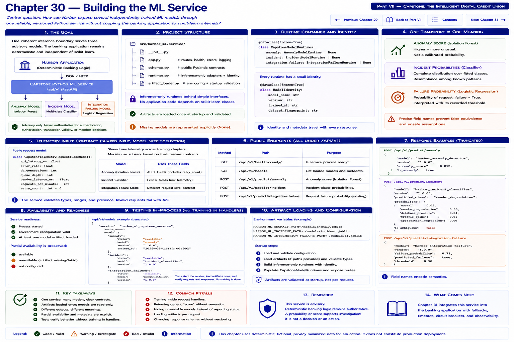

# Chapter 30 — Building the ML Service

[Previous: Chapter 29 — Training the Incident Classifier](chapter-29-training-the-incident-classifier.md) · [Back to Part VII](README.md) · [Complete contents](../../CONTENTS.md) · [Next: Chapter 31 — Integrating the Banking Application](chapter-31-integrating-the-banking-application.md)




**Central question:** How can Harbor expose several independently trained ML models through one reliable, versioned Python service without coupling the banking application to scikit-learn internals?

Harbor Federal Credit Union now has three useful models. The capstone anomaly detector asks, “Does current telemetry differ substantially from the learned healthy baseline?” The incident classifier asks, “Which known incident pattern does current telemetry most resemble?” The integration-failure model asks, “How strongly does this request resemble historical request-failure examples?”

A naive deployment gives Harbor three scripts, three ports, three unrelated JSON contracts, three health checks, and three loading conventions. That is integration complexity rather than useful separation. Harbor instead evolves Chapter 18 into one coherent inference boundary:

```text
                      HARBOR APPLICATION
                             │
                             │ JSON / HTTP
                             ▼
                   CAPSTONE PYTHON ML SERVICE
                             │
             ┌───────────────┼─────────────────┐
             │               │                 │
             ▼               ▼                 ▼
       ANOMALY MODEL   INCIDENT MODEL   INTEGRATION-FAILURE
             │               │                 │
             └───────────────┼─────────────────┘
                             │
                             ▼
                   VERSIONED RESPONSES
```

This service is advisory. It is never authoritative for authentication, authorization, transaction validity, member eligibility, financial approval, or deterministic vendor and business rules. Core banking behavior remains deterministic even when every model is unavailable.

## Learning objectives

By the end of this chapter, you can:

1. serve several artifacts from one FastAPI application;
2. define typed, effectively read-only model runtimes;
3. load trusted artifacts once before serving predictions;
4. represent partial model availability and readiness;
5. expose safe model and version metadata;
6. preserve distinct request and response semantics;
7. distinguish an Isolation Forest anomaly score from a probability;
8. return the classifier's complete fitted-class probability map and ambiguity;
9. retain Chapter 18's integration-failure contract;
10. test every endpoint in process, without training in a handler; and
11. keep clients independent of scikit-learn classes and serialization.

## Evolve Chapter 18; do not replace it

Chapter 18 already established the canonical integration route:

```text
POST /api/v1/predict/integration-failure
```

Chapter 30 preserves its request fields and response semantics. The new package separates concerns rather than growing one giant module:

```text
src/harbor_ml/service/
├── __init__.py
├── app.py               # routes, availability, controlled errors, logging
├── schemas.py           # public Pydantic wire contracts
├── runtimes.py          # inference-only adapters and identity
└── artifact_loader.py   # environment configuration and startup validation
```

`ModelIdentity` gives every runtime the same small identity concept. `AnomalyModelRuntime`, `IncidentModelRuntime`, and `IntegrationFailureRuntime` retain model-specific behavior. `CapstoneModelRuntimes` holds optional runtime references:

```python
@dataclass(frozen=True)
class CapstoneModelRuntimes:
    anomaly: AnomalyModelRuntime | None
    incident: IncidentModelRuntime | None
    integration_failure: IntegrationFailureRuntime | None
```

The container makes missing state explicit. It does not manufacture an unfitted model, a constant response, or a fake “normal” prediction.

## One transport is not one meaning

```text
SHARED TRANSPORT
        ≠
SHARED SEMANTICS
```

All three capabilities benefit from JSON, validation, health reporting, logs, OpenAPI, and an `/api/v1` namespace. Their outputs nevertheless mean different things:

- `anomaly_score` is `-decision_function` from the fitted Isolation Forest. Higher is more unusual; it is **not** calibrated probability.
- `failure_probability` is the integration classifier's positive-class probability, interpreted with its recorded threshold.
- incident `probabilities` are a complete distribution over the fitted closed taxonomy. They express resemblance among known classes, not confirmed root cause.

A generic `{"score": 0.8, "flag": true}` would create false equivalence. Precise field names are part of safe engineering.

## Shared telemetry input, model-specific selection

Chapters 28 and 29 share six raw telemetry features. The anomaly model additionally uses `retry_count`. The public `CapstoneTelemetryRequest` therefore uses their seven-field union:

```python
class CapstoneTelemetryRequest(BaseModel):
    api_latency_ms: float
    error_rate: float
    db_connections: int
    queue_depth: int
    vendor_latency_ms: float
    requests_per_minute: float
    retry_count: int
```

The anomaly runtime selects its ordered seven fields; the incident runtime selects its ordered six fields. The client sees a stable telemetry contract rather than an `ndarray`, pipeline, transformer, or `classes_` index. The contract rejects extra fields, non-finite numbers, negative latencies/counts/rates, and error rates outside `[0, 1]`. It contains no member identity.

The service names this contract `capstone-telemetry-v1` in health metadata. Clients need not echo it on every request. A future incompatible feature wire contract requires deliberate coordination rather than silent column reordering.

## Typed endpoint contracts

The service exposes exactly these primary routes:

```text
GET  /api/v1/health
POST /api/v1/score/telemetry-anomaly
POST /api/v1/predict/incident
POST /api/v1/predict/integration-failure
```

It intentionally does not provide `/predict-everything`. Different consumers need different signals; coupling responses lets one unavailable model poison an unrelated capability and blurs meanings.

### Telemetry anomaly score

```json
{
  "model": "harbor-capstone-anomaly",
  "model_version": "harbor-capstone-anomaly-…",
  "anomaly_score": 0.43,
  "is_anomaly": true
}
```

The runtime uses the Chapter 28 orientation: `anomaly_score = -decision_function`. `is_anomaly` comes from the fitted detector's `-1` prediction. There is deliberately no `anomaly_probability`.

### Incident-pattern prediction

```json
{
  "model": "harbor-capstone-incident",
  "model_version": "harbor-capstone-incident-…",
  "predicted_class": "vendor_degradation",
  "probabilities": {
    "normal": 0.03,
    "vendor_degradation": 0.47,
    "database_pressure": 0.41,
    "traffic_spike": 0.05,
    "application_regression": 0.04
  },
  "top_probability": 0.47,
  "second_probability": 0.41,
  "probability_gap": 0.06,
  "ambiguous": true
}
```

Actual values depend on the artifact and input. The runtime maps columns with fitted `classes_`, then verifies every probability is finite and in `[0, 1]`, and that their sum is approximately one. It returns the complete taxonomy rather than only argmax. `ambiguous` is true when `top_probability - second_probability` is below the metadata threshold.

A response such as `vendor_degradation = 0.78` establishes only that current telemetry strongly resembles the fitted model's vendor-degradation class. It does not confirm the vendor as root cause.

### Integration-failure prediction

The Chapter 18 request and response remain compatible:

```json
{
  "model": "harbor-integration-failure",
  "model_version": "harbor-integration-failure-…",
  "failure_probability": 0.71,
  "threshold": 0.5,
  "predicted_failure": true
}
```

Every prediction includes `model` and `model_version`. No request identifier existed in Chapter 18, so Chapter 30 does not add one gratuitously.

## Trusted startup loading

Artifact selection is operator configuration, never request input:

```text
HARBOR_CAPSTONE_ANOMALY_MODEL_PATH
HARBOR_CAPSTONE_ANOMALY_METADATA_PATH
HARBOR_CAPSTONE_INCIDENT_MODEL_PATH
HARBOR_CAPSTONE_INCIDENT_METADATA_PATH
HARBOR_INTEGRATION_FAILURE_MODEL_PATH
HARBOR_INTEGRATION_FAILURE_METADATA_PATH
```

`ServiceConfig.from_environment()` supplies gitignored local defaults and supports explicit overrides. `load_configured_runtimes()` attempts each model independently at process initialization. `create_app(runtimes)` injects the resulting container. A handler only selects features and invokes an already fitted estimator; it never calls `joblib.load`, `fit`, or a training function.

Deserialization success is not compatibility. The loader checks:

- expected model name and nonempty version;
- expected model type for anomaly and incident artifacts;
- exact ordered feature metadata;
- the incident taxonomy, fitted `classes_`, and ambiguity threshold; and
- integration numeric/categorical fields, target, and classification threshold.

The Chapter 28/29 metadata fingerprints the training dataset but does not record an artifact-file SHA-256. Chapter 30 preserves that convention rather than inventing a partial signing system. In production, an artifact registry or manifest should verify the artifact digest before deserialization:

```text
file exists
    ≠
file is the expected artifact
```

Joblib/pickle artifacts can execute code while loading. Only a controlled build/deployment workflow may place these local artifacts. The API never accepts an artifact upload or a `model_path` field.

## Liveness, readiness, and partial degradation

```text
LIVENESS
process is running

READINESS
all required models are available
```

For this lab, all three models are required for full readiness. One endpoint reports both concepts. A production platform may use separate liveness and readiness URLs.

All loaded:

```json
{
  "status": "ok",
  "ready": true,
  "models": {
    "capstone_anomaly": {"loaded": true, "version": "…", "feature_contract_version": "capstone-telemetry-v1"},
    "capstone_incident": {"loaded": true, "version": "…", "feature_contract_version": "capstone-telemetry-v1"},
    "integration_failure": {"loaded": true, "version": "…", "feature_contract_version": null}
  }
}
```

If incident loading fails, health becomes `degraded`, `ready` becomes false, and that model reports `loaded: false`, `version: null`. Paths, loading exceptions, and stack traces never enter the response. The behavior is capability-specific:

```text
MODEL A DOWN
      │
      ▼
only Model A capability unavailable

OTHER ML CAPABILITIES
remain available where safe

CORE BANKING APPLICATION
remains deterministic
```

Incident prediction then returns `503 {"detail":"Incident prediction model is unavailable."}` while anomaly and integration predictions still work. This is honest partial degradation, not a `200` with a fabricated value.

## Error and logging boundaries

The API distinguishes:

- **422** — Pydantic rejected invalid or unexpected input;
- **503** — the specifically requested model is unavailable;
- **500** — an unexpected inference failure occurred after validation.

Internal structured log events record route, model, model version, success/failure, and elapsed inference milliseconds. Bodies are not logged. Public responses omit latency, paths, exception messages, coefficients, and training locations. Chapter 25's monitoring layer can aggregate these events without changing the contract.

Fitted scikit-learn estimators are read only during inference. Handlers must not mutate estimators or shared arrays. Multiple worker processes each load their own runtime set at process startup; production sizing must account for that memory. Library-specific thread-safety and resource limits still require deployment testing.

## API version versus model version

```text
API version:    v1
model version:  harbor-capstone-incident-abc123
```

The API version describes the wire contract. The model version identifies the fitted artifact. Harbor can deploy a new compatible incident model behind the same `/api/v1/predict/incident` route:

```text
same /api/v1/predict/incident
        │
        ▼
new model version deployed
```

Clients remain unchanged, while logs and monitoring record which version served a prediction. A breaking JSON contract—not merely new weights—may justify `/api/v2`.

## Run the executable laboratory

The example trains three small models only to create temporary local artifacts **before** constructing the app. It then loads all runtimes, creates `TestClient`, exercises healthy and degraded telemetry, incident and integration predictions, simulates a missing incident runtime, proves the other routes remain available, and prints a controlled 422:

```bash
python examples/chapter_30_capstone_ml_service.py
```

No TCP server or external data is required. The temporary directory is removed afterward and `artifacts/` remains ignored.

For persistent local startup, first run the three controlled training commands:

```bash
python scripts/train_integration_failure_model.py
python scripts/train_capstone_anomaly.py
python scripts/train_capstone_incident_classifier.py
uvicorn harbor_ml.service.app:app --reload
```

Run from the repository root with `src` installed or on `PYTHONPATH` (for example, `PYTHONPATH=src uvicorn ...`). The module loads configured artifacts once during import. If one is absent or incompatible, it starts degraded rather than substituting a model. Visit `http://127.0.0.1:8000/docs`; OpenAPI now displays several distinct ML contracts for Chapter 31's future PHP clients.

## Local curl examples

Health:

```bash
curl -s http://127.0.0.1:8000/api/v1/health
```

Anomaly:

```bash
curl -s -X POST http://127.0.0.1:8000/api/v1/score/telemetry-anomaly \
  -H 'Content-Type: application/json' \
  -d '{"api_latency_ms":1480,"error_rate":0.047,"db_connections":78,"queue_depth":96,"vendor_latency_ms":1320,"requests_per_minute":760,"retry_count":3}'
```

Incident:

```bash
curl -s -X POST http://127.0.0.1:8000/api/v1/predict/incident \
  -H 'Content-Type: application/json' \
  -d '{"api_latency_ms":1480,"error_rate":0.047,"db_connections":78,"queue_depth":96,"vendor_latency_ms":1320,"requests_per_minute":760,"retry_count":3}'
```

Integration failure:

```bash
curl -s -X POST http://127.0.0.1:8000/api/v1/predict/integration-failure \
  -H 'Content-Type: application/json' \
  -d '{"vendor":"ClearVerify","endpoint":"identity_verify","recent_vendor_latency_ms":940,"recent_vendor_error_rate":0.031,"queue_depth":42,"retry_count":1,"request_size_bytes":2400,"hour_of_day":14}'
```

All payloads are fictional and local.

## Contract tests

`tests/test_capstone_service.py` creates temporary trusted artifacts and asserts:

- all-runtime app creation and actual per-model health;
- exact anomaly, incident, and preserved integration response keys;
- finite anomaly scoring with no probability mislabel;
- complete, normalized incident probabilities and consistent ambiguity;
- model versions in every prediction;
- 422 validation and prohibited-field exclusion;
- controlled model-specific 503 and survival of other capabilities;
- repeated deterministic inference; and
- no estimator fitting in the handler.

Artifact loading occurs before the `TestClient` serves a request. Tests need no network server.

## Security and operational boundaries

Keep this service internal and least-privileged. It needs trusted artifacts and inference dependencies, not training datasets, member identifiers, application credentials, model-upload permissions, or write access to core banking systems. Do not expose:

```text
POST /train
POST /retrain
POST /upload-model
```

Training is a separate, reviewed workflow. Likewise, never accept this:

```json
{"model_path": "/tmp/model.joblib"}
```

Strict input allowlists, limited logs, controlled artifact provenance, read-only runtime behavior, and deterministic application fallbacks reduce the boundary's risk. Model advice cannot authorize or reject a banking operation.

## Exercises

### Exercise 1 — Shared service, different meanings

Why retain `anomaly_score` and `failure_probability` instead of naming both `score`? Explain their different mathematical and operational meanings.

### Exercise 2 — Partial degradation

If the incident classifier fails to load, should anomaly scoring also return 503? Explain why capability isolation is safer than coupling availability.

### Exercise 3 — API version versus model version

Harbor deploys a newly trained incident artifact with an unchanged JSON contract. Must the route become `/api/v2/predict/incident`? Explain what should change instead.

### Exercise 4 — Training endpoint

Why should this inference service not expose `POST /retrain`? Consider permissions, resource use, data access, reproducibility, approval, and rollback.

### Exercise 5 — Model metadata

Why must loading verify the exact feature contract rather than merely deserialize a file successfully? Describe a plausible reordered-column failure.

### Exercise 6 — Root cause

If `vendor_degradation = 0.78`, what is established? The correct statement is: **The current telemetry strongly resembles the fitted model's vendor-degradation class.** Explain why “the vendor is confirmed as root cause” is unsupported.

### Coding exercise — safe model inventory

Add `GET /api/v1/models` as an internal endpoint with a typed response:

```json
{"models":[{"name":"harbor-capstone-anomaly","version":"…","loaded":true}]}
```

Add tests. Return only name, version, and loaded state—never artifact paths, coefficients, stack traces, or training-data locations. Explain how this inventory helps operators confirm rollout and partial availability without unnecessarily exposing internals. This exercise is intentionally not implemented in the chapter solution.

## Key takeaways

1. Multiple ML models can share one service without sharing one semantic meaning.
2. Each endpoint needs a precise contract.
3. Trusted artifacts load once before prediction traffic.
4. Model-specific unavailability should degrade only the affected capability where safe.
5. Health and readiness report real model availability.
6. Isolation Forest anomaly scores are not probabilities.
7. Incident responses preserve the complete class distribution and ambiguity.
8. API and model versions solve different versioning problems.
9. Training remains separate from inference.
10. Serving several models is fundamentally an API and dependency-management problem.

## What comes next: Chapter 31 — Integrating the Banking Application

Chapter 30 provides the complete capstone ML service. Chapter 31 will extend Chapter 19 to connect Harbor's PHP application to all three advisory capabilities:

```text
PHP APPLICATION
      │
      ▼
ML GATEWAY / CLIENT
      │
      ├── anomaly score
      ├── incident prediction
      └── integration failure prediction
      │
      ▼
APPLICATION OBSERVABILITY
```

It will cover typed anomaly and incident DTOs, a shared ML gateway, sequential/parallel tradeoffs, timeouts, partial ML failure, application-level observation aggregation, deterministic business outcomes, and integration tests. Continue with the implemented Chapter 31 gateway and application integration.

[Previous: Chapter 29 — Training the Incident Classifier](chapter-29-training-the-incident-classifier.md) · [Back to Part VII](README.md) · [Complete contents](../../CONTENTS.md) · [Next: Chapter 31 — Integrating the Banking Application](chapter-31-integrating-the-banking-application.md)
